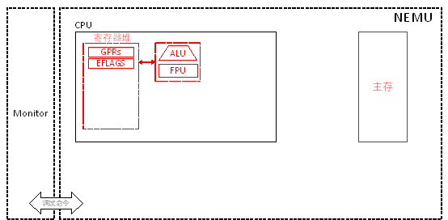

# PA 1-1 数据在计算机内的存储

在构建一台能计算的机器之前，我们首先要尝试将计算的对象——数据妥善地存放在计算机中。



图1-1 PA 1路线图

## §1-1.1 预备知识

#### §1-1.1.1 数据存储和读写

在计算机内部，数据的存储往往采用层次化的存储器体系结构。在NEMU中，我们也根据这种层次化的方法，将存储器体系结果划分为寄存器、高速缓存（cache）、主存储器（RAM）、辅助存储器（硬盘）这四个层次，这四个层次的关系基本是越来越慢，越来越便宜（存储量自然越来越大），离CPU核心越来越远。在当前的实验中，为了使得NEMU具备最基本的运行能力，我们需要构建其中的两个层次，即，寄存器和主存储器（在本教程术语中，主存等于内存）。由于我们选择了IA-32指令集体系结构，那么我们的数据存储器件和规范就遵照对应的x86体系结构（在本教程术语中x86等于i386）。

数据存储的最小单位是比特，即可以存储1位0或1。8个比特构成了内存中可编址的最小单位，字节（byte）。2个字节16比特构成一个字（word）。4个字节构成一个双字（double word）。

#### §1-1.1.2 寄存器

寄存器是位于CPU内部的存储器，可以由CPU直接访问。为了实现最基本的数据存储以支持马上要展开的运算和指令执行的功能，我们需要模拟8个通用寄存器（General Purpose Register, GPR）和程序计数器（PC）。我们模拟的是32位机器，因此这八个通用寄存器均为32位，依次为：
`eax`, `ecx`, `edx`, `ebx`, `esp`, `ebp`, `esi`, `edi`

为了实现向下兼容，这八个通用寄存器的低16位分别对应于
`ax`, `cx`, `dx`, `bx`, `sp`, `bp`, `si`, `di`
这8个通用寄存器。

同时，`ax`, `cx`, `dx`, `bx`这四个通用寄存器的高8位和低8位又分别对应于：
`ah`, `al`, `ch`, `cl`, `dh`, `dl`, `bh`, `bl`
这8个通用寄存器。

可见，x86体系结构的通用寄存器结构可以用下图来表示（摘录自i386手册Figure 2-5）：

```
General Purpose Registers:

  31               23                15                7              0
╔═════════════════╪═════════════════╬═════════════════╧═════════════════╗
║                                  EAX       AH       AX        AL      ║
╠═════════════════╪═════════════════╬═════════════════╩═════════════════╣
║                                  EDX       DH       DX        DL      ║
╠═════════════════╪═════════════════╬═════════════════╩═════════════════╣
║                                  ECX       CH       CX        CL      ║
╠═════════════════╪═════════════════╬═════════════════╩═════════════════╣
║                                  EBX       BH       BX        BL      ║
╠═════════════════╪═════════════════╬═════════════════╩═════════════════╣
║                                  EBP                BP                ║
╠═════════════════╪═════════════════╬═════════════════╪═════════════════╣
║                                  ESI                SI                ║
╠═════════════════╪═════════════════╬═════════════════╪═════════════════╣
║                                  EDI                DI                ║
╠═════════════════╪═════════════════╬═════════════════╪═════════════════╣
║                                  ESP                SP                ║
╚═════════════════╪═════════════════╬═════════════════╪═════════════════╝
图1-2：通用寄存器结构
```

程序计数器也是32位，在NEMU的模拟CPU中，由`eip`寄存器来表示。

#### §1-1.1.3 主存

主存从器件来看就是插在机器主板上的内存条，通过存储器总线和CPU相连。以目前常用的DRAM芯片技术来说，主存的内部构成也有一点小复杂<font color=red>（参见课本第233页6.2节的内容）</font>。但是，在本教程中，我们无需关心其复杂的内部结构，而只关注它对外所展现出来的存取接口。

我们只需要理解主存就是一个由字节构成的数组，数组的下标就是内存地址，而数组中某下标对应的元素就是主存中该地址对应的字节数据。这么介绍虽然有些本末倒置的意味，但是鉴于大家先学了C语言编程，这么类比应该能够比较快速地理解主存对外所展现出来的形象。

x86采用小端方式存储数据，它规定了超过一个字节的数据的存储规则：低有效字节放在低地址，高有效字节放在高地址。

## §1-1.2 代码导读和实验理解

#### §1-1.2.1 寄存器模拟

NEMU中模拟寄存器文件的代码位于`nemu/include/cpu/reg.h`头文件中，对应于`CPU_STATE`这个结构体。

在源文件`nemu/src/cpu/cpu.c`中定义了全局变量`CPU_STATUS cpu`，这样，在程序的其它模块中，我们就可以通过类似`x = cpu.eax`这样的语句，来访问寄存器的值了。

但是，目前框架代码中的寄存器结构体实现并不完善。我们希望以`cpu.eax`形式访问的和以`cpu.gpr[0]._32`形式访问的是同一个模拟寄存器，同时`cpu.gpr[0]._16`能够访问到`cpu.eax`的低16位也就是`ax寄存器`，`cpu.gpr[0]._8[0]`访问到`cpu.eax`的低8位也就是`al`寄存器等。在`nemu/src/main.c`中的`main()`函数里，我们一开始就执行了`reg_test()`测试用例。你需要调整寄存器结构体的实现方式，使其满足上述要求，并通过`reg_test()`测试用例。

作为实验的开篇，我们在此给出一个参考答案：

```c
typedef struct 
{
	union {
		union {
			union {
				uint32_t _32;
				uint16_t _16;
				uint8_t _8[2];
			};
			uint32_t val;
		} gpr[8];
		struct { // do not change the order of the registers
			uint32_t eax, ecx, edx, ebx, esp, ebp, esi, edi;
		};
	};
} CPU_STATE;
```


**注意，在框架代码中，我们已经预先为后续阶段要用到的寄存器排好了顺序并留出了空间，请不要改动这些顺序，否则在PA 2-1及其后续阶段使用__ref_参考指令实现的时候，会遇到不可预知的结果。**


#### §1-1.2.2 主存模拟

在头文件`nemu/include/memory/memory.h`中，我们定义宏：
```c
#define MEM_SIZE_B 128*1024*1024
```


约定NEMU拥有128MB字节的内存。紧接着，在源文件`nemu/src/memory/memory.c`中，我们定义数组：
```c
uint8_t hw_mem[MEM_SIZE_B];
```


如此一来，我们的模拟主存就构建完成了。但是但有主存物理器件的模拟尚且不够，我们还需要为它创建读写接口。创建读写接口的目的是为了对模块提供的功能进行封装，以免其它外部模块直接接触模块的内部核心数据，产生不可预料的后果。在头文件`nemu/include/memory/memory.h`中，我们声明了六个读写函数：
```c
// 物理地址读写
uint32_t paddr_read(paddr_t addr, size_t len);
void paddr_write(paddr_t addr, size_t len, uint32_t data);

// 线性地址读写
uint32_t laddr_read(laddr_t addr, size_t len);
void laddr_write(laddr_t addr, size_t len, uint32_t data);

// 虚拟地址读写
uint32_t vaddr_read(vaddr_t addr, uint8_t sreg, size_t len);
void vaddr_write(vaddr_t addr, uint8_t sreg, size_t len, uint32_t data);
```

*---原教程和框架代码对`vaddr_read()`和`vaddr_write()`的定义不一致，此处已更正，感谢16级许翔同学*

这六个函数的第一个`xaddr_t`类型的参数都是待读写的内存地址，第二个`size_t`类型的参数（`len`）都是待读写的数据的长度（字节数），对于虚拟地址读写来说，仅可以是1、2、4中的某一个值。对于所有的`read()`函数，其返回的`uint32_t`类型数据即为模拟内存中从`addr`开始连续`len`个字节的数据内容，若`len`小于4，在返回值高位补0。对于所有的`write()`函数，其第三个`uint32_t`类型的参数（`data`）即为要写入的数据，写入位置为模拟内存中从`addr`开始连续`len`个字节，若`len`小于4，则将`data`高位截断。注意NEMU采用小端方式存储数据。

在介绍存储管理之前，NEMU工作在类似实地址模式下。此时，虚拟地址等于线性地址等于物理地址，因此，在源文件`nemu/src/memory/memory.c`中，虚拟地址和线性地址的读写函数简单实现为：

```c
uint32_t paddr_read(paddr_t paddr, size_t len) {
    return hw_mem_read(paddr, len);
}
void paddr_write(paddr_t paddr, size_t len, uint32_t data) { 
    hw_mem_write(paddr, len, data);
}

uint32_t laddr_read(laddr_t laddr, size_t len) {
    return paddr_read(laddr, len);
}

void laddr_write(laddr_t laddr, size_t len, uint32_t data) {
    paddr_write(laddr, len, data);
}

uint32_t vaddr_read(vaddr_t vaddr, uint8_t sreg, size_t len) {
    assert(len == 1 || len == 2 || len == 4);
    return laddr_read(vaddr, len);
}

void vaddr_write(vaddr_t vaddr, uint8_t sreg, size_t len, uint32_t data) {
    assert(len == 1 || len == 2 || len == 4);
    laddr_write(vaddr, len, data);
}
```

随着实验进展到PA 3，我们会在这里进行大量的实验。在目前阶段，我们对于内存读写的接口无需进行修改。

## §1-1.3 实验过程及要求

##### * 代码要求

1. 修改`CPU_STATE`结构体中的通用寄存器结构体；

2. `make clean`后使用`make`编译项目；

3. 在项目根目录通过`make test_pa-1`命令执行并通过`reg_test()`测试用例。

## 本阶段要修改的代码清单（参考）

* `nemu/include/cpu/reg.h`
