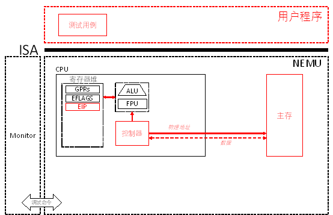

# PA 2-1 指令解码与执行

在完成了基本的运算功能后，我们希望计算机能够按照我们的命令来执行各种运算。在这一阶段，我们就要赋予NEMU这样的能力。



图2-1 PA 2-1路线图

本章较长，给出导航：

* [§2-1.1 预备知识](#2-11-预备知识)
* [§2-1.2 代码导读和实验理解](#2-12-代码导读和实验理解)
  - [§2-1.2.1 测试用例](#2-121-测试用例)
  - [§2-1.2.2 指令循环的模拟](#2-122-指令循环的模拟)
  - [§2-1.2.3 模拟指令解码和执行](#2-123-模拟指令解码和执行)
  - [§2-1.2.4 操作数和操作数寻址](#2-124-操作数和操作数寻址)
  - [§2-1.2.5 利用框架代码实践KISS原则](#2-125-利用框架代码实践KISS原则)
* [§2-1.3 实验过程及要求](#2-13-实验过程及要求)


## §2-1.1 预备知识

在计算机中，一切信息都按照某种规则编码为由01串组成的数据形式，在PA 1中所介绍的整数和浮点数是如此，指挥机器运行的指令也是如此。每一条指令都指明了计算机所需要进行的一步操作（操作码）和操作的对象（操作数）。若我们使用机器语言写程序，那么一个程序就是一个指令的序列。这个序列规定了计算机解决问题所需要执行的各个步骤。若我们使用高级语言（如C语言）写程序，那么往往需要使用编译器将高级语言程序编译成指令序列后再交给机器去执行。 

机器执行程序的过程就是按序执行事先编制好的指令序列的过程。

#### §2-1.1.1 指令的格式

NEMU模拟的是一个简化的IA-32体系结构，采用同样的指令集体系结构。

##### * 指令的格式

一条指令从其基本的构成上来说，需要包含两部分内容：

1. 指令的操作码（`opcode`）：用于指明指令所对应的行为是什么，如数据移动、加法运算、跳转等；

2. 指令的操作数（`operand`）：对于涉及数据操作的指令，我们还需要指明指令所操作的对象是什么。操作数可能是指令中直接给出的一个数字，称为立即数（`immediate`）；也可以是一个寄存器编号；或者是一个内存地址。

在IA-32体系结构中，一条指令的格式可以由下图来表示：

```
+-----------+-----------+-----------+--------+------+------+------+------------+-----------+
|instruction| address-  | operand-  |segment |opcode|ModR/M| SIB  |displacement| immediate |
|  prefix   |size prefix|size prefix|override|      |      |      |            |           |
|-----------+-----------+-----------+--------+------+------+------+------------+-----------| 
|   0 OR 1  |   0 OR 1  |   0 OR 1  | 0 OR 1 |1 OR 2|0 OR 1|0 OR 1| 0,1,2 OR 4 |0,1,2 OR 4 |
| - - - - - - - - - - - - - - - - - - - - - - - - - - - - - - - - - - - - - - - - - - - - -| 
|                                       number of bytes                                    | 
+------------------------------------------------------------------------------------------+

图2-2 指令格式
```

其中包含的信息如下:

1. 指令中必须的部分是操作码（`opcode`），它指出指令对应要执行的功能是什么；

2. 在操作码前面可能会出现一些前缀（`prefix`），用于指明指令采用的地址长度（`address-size`）或操作数长度（`operand-size`）等。在NEMU中，我们只考虑操作数长度前缀，其值为`0x66`。当`opcode`所对应的操作数长度可变时（16位或32位），若`opcode`前面出现`0x66`，则操作数长度临时改变为16位，否则为32位。操作数长度是8位的指令其`opcode`区别于其它操作数长度的同类指令，不会产生混淆；

3. `ModR/M`、`SIB`、`displacement`这三个域通过各种组合构成了多种可能的操作数寻址方式。结合课本第99页图3.4了解所有可能的寻址方式；

4. `Immediate`部分指定了指令中可能出现的立即数，对应立即数寻址方式。

##### * 指令的解码和执行

针对IA-32指令集，我们从实用主义的角度，通过一个例子结合i386手册来介绍指令的解码过程。等一条指令解码完成，我们就清楚其详细的含义，模拟其对应的执行就很直接了。

假设当前我们的PC指向下面这串代码段数据（16进制）的第一个字节（`0xC7`）：

```
8b 94 83 00 11 00 00 8b 45 f4
```

**第一步**，看第一个字节。发现不是`0x66`，那么`0x8b`就是`opcode`。

**第二步**，使用`opcode`去i386手册的Appendix A Opcode Map部分(pg. 412)查表。发现`0x8b`对应的指令为`MOV Gv, Ev`。请注意i386手册使用的是Intel格式的汇编，而我们的教程和NEMU中使用的是AT&T格式的汇编，其主要区别是操作数顺序正好颠倒，在Intel格式中，源操作数在右边，目的操作数在左边。因此这条指令的含义是将一个`Ev`源操作数`MOV`到`Gv`目的操作数中去。

在Appendix A Opcode Map的开头部分，我们了解到`Ev`和`Gv`分别指代一个变长（`v`指明操作数可能是16位或32位）的，由`ModR/M`字节所指定的寄存器或内存地址（`E`），和一个由`ModR/M`字节的`reg`域指定的通用寄存器。由于我们在第一步就了解到`opcode`之前不存在`0x66`操作数长度前缀，因此操作数长度确定为32位。

**第三步**，如果不清楚`MOV`的具体细节，到i386手册的Chapter 17.2.2.11部分仔细查找，定位到第345页的说明。仔细阅读其中的内容，其中包含了每一条指令所涉及的每一项细节且没有歧义。当然，其中难免存在一些笔误，在本教程的最后部分，我们附上一份勘误，其中包含了目前已经发现的手册中的错误。

通过以上三步，我们已经完成了对`opcode`的解码，知道这条指令要做什么了，接下来，就是进一步确定其操作数的过程：

**第四步**，解码操作数。在第二步中我们就已经了解到，`opcode`后面跟随着的是`ModR/M`字节。于是确定`0x94`是`ModR/M`字节。`ModR/M`字节的结构请查阅i386手册第17.2.1节。其解析方式对应Table 17-3。通过查表我们发现，`0x94`这个`ModR/M`字节的`reg`域为二进制`010`，结合`Gv`的说明，得知目的操作数为`2`号通用寄存器，即，`%edx`。而进一步组合`Mod`和`R/M`域，我们得知源操作数形式为`disp32[--] [--]`，还需要解析`SIB`字节。

根据上述分析，确定第三个字节`0x83`是`SIB`字节。`SIB`字节结构请查阅i386手册手册第17.2.1节。通过查表Table 17-4，得知`base`为`%ebx`，`scaled index`为`%eax * 4`。注意手册中有关`ModR/M`和`SIB`字节的解析表都存在一些笔误，请同样查阅教程最后的勘误部分。

根据`ModR/M`字节所指出的操作数格式，最后我们还跟着一个32位的偏移量`disp32`。所以后续的四字节内容`00 11 00 00`是`disp32`。小端方式，对应真值`0x1100`。从而得知源操作数存储在主存位于地址`0x1100 + %ebx + %eax * 4`的4字节（32位）存储区域中。

至此，这条指令中所有信息都已清楚，指令解码完成。通过上述一步一步地解码操作码和操作数，我们得知原来代码段的这一串数据：

```
8b 94 83 00 11 00 00
```

对应用AT&T格式汇编书写的指令：

```asm
mov 0x1100(%ebx, %eax, 4), %edx
```

而后面的数据，就是属于下一条指令的内容了。在解码并执行完当前指令后，只需将程序计数器指向下一条指令的首地址，并重复上述过程便可以执行指令的序列了。

#### §2-1.1.2 CPU顺序执行指令序列的过程

当程序员写好程序，并将对应的指令序列存储到主存的某一段位置后，便可以请求机器来执行这个程序了。在目前阶段，我们不考虑如流水线、乱序发射等复杂的执行方式，仅考虑最基本的顺序执行指令序列的情形。无论是多复杂的执行方式，都可以看做是对执行效率的优化，不改变某一个程序执行的基本逻辑：按照程序员指定的指令序列去一条接一条的执行指令，从而完成某一项工作。

当程序在内存中就位后，机器便可以开始执行程序了。若机器和程序员约定好第一条指令的位置，那么机器就能够在时钟脉冲的激励下，从第一条指令开始，一条接一条地解码并执行每一条指令（参照上一小节中所述过程）。这个过程可以理解成一个循环：

1. 获取当前要执行的指令，约定当前指令的位置存放在程序计数器（PC）中；

2. 对指令的操作码、源操作数和目的操作数进行解码；
3. 取源操作数；

4. 执行解码好的指令；

5. 存目的操作数；

6. 计算下一条指令的地址，更新PC并跳转到第1步。

以上过程可以结合课本第223页的图5.1进行理解。

## 2-1.2 代码导读和实验理解

在掌握了基本的预备知识后，就可以在NEMU中模拟指令的解码和执行过程，进而执行各种各样的用户程序了。

#### §2-1.2.1 测试用例

##### * 使用make run和make test系列命令运行测试用例

框架代码提供两类命令来编译和执行测试用例，分别是

> make run

和

> make test_pa-<stage>

具体到PA 2-1，则是

> make test_pa-2-1

在项目根目录控制台键入`make run`之后，`make`程序会搜索根目录下的`Makefile`文件，并执行其中的`run`目标。这个目标依赖目标`nemu`，后者会执行编译。若编译成功，会执行命令`./nemu/nemu –testcase <testcase_name>`，其中的`<testcase_name>`对应的是测试用例的名称，也就是`testcase/src/`文件夹下各个测试用例程序去除后缀之后的文件名。

在执行命令`./nemu/nemu –testcase <testcase_name>`时，会首先进入NEMU的`main()`函数。在`main()`函数中，NEMU首先根据执行参数配置好测试用例的文件路径，并执行`single_run()`函数。`single_run()`函数对应NEMU的一次执行。在`single_run()`函数中，会完成一系列的初始化工作，最后进入`ui_mainloop()`函数。`ui_mainloop()`函数是NEMU中`monitor`的一部分。`Monitor`提供了一个基于命令行的交互式界面，我们可以在这个交互式界面中通过键入各种命令来实现包括执行测试用例、设置断点和监视点、查看寄存器和内存等程序状态信息的功能。下表总结了`monitor`所提供的命令及其含义：

| **命令**         | **格式**   | **使用举例**   | **说明**                                                     |
| ---------------- | ---------- | -------------- | ------------------------------------------------------------ |
| 帮助             | Help       | help           | 打印帮助信息                                                 |
| 继续运行         | C          | c              | 继续运行被暂停的程序                                         |
| 退出             | Q          | q              | 退出当前正在运行的程序                                       |
| 单步执行         | si [N]     | si 10          | 单步执行N条指令，N缺省为1                                    |
| 打印程序状态     | info <r/w> | info r  info w | 打印寄存器状态  打印监视点信息                               |
| \* 表达式求值     | p EXPR     | p $eax + 1     | 求出表达式EXPR的值（EXPR中可以出现数字，0x开头的十六进制数字，$开头的寄存器，\*开头的指针解引用，括号对，和算术运算符） |
| \* 扫描内存        | x N EXPR   | x 10 0x10000   | 以表达式EXPR的值为起始地址，以十六进制形式连续输出N个4字节   |
| \* 设置监视点      | w EXPR     | w \*0x2000      | 当表达式EXPR的值发生变化时，暂停程序运行                     |
| \* 设置断点        | b EXPR     | b main         | 在EXPR处设置断点。除此以外，框架代码还提供了宏BREAK_POINT，可以插入到用户程序中，起到断点的作用 |
| 删除监视点或断点 | d N        | d 2            | 删除第N号监视点或断点                                        |

\* 表达式EXPR求值的功能在可选任务PA 2-3.1中实现，在此之前你可能无法使用这些命令，但你可以使用一些比较简单的实现，如约定EXPR一定是一个16进制数字这样的方式来开启这些命令。

进入交互式界面后，可以通过

> (nemu) c

命令执行测试用例。

与`make run`类似，`make test`系列命令也提供了编译和运行测试用例的功能，区别是它会自动执行对应阶段所有的测试用例。只有当触发断点时才会进入`monitor`的交互式界面。

在实现指令的过程中，可能会遇到大量的bug需要调试。要学会善用断点和测试用例。虽然我们最后会以框架代码所提供的测试用例作为基准，但是这并不意味着在实验过程中不能增加或修改测试用例。你可以不断地构造新的测试用例，也可以剪裁已有的测试用例，来缩小被测试代码的范围，从而更加准确地定位bug并修复之。程序中的逻辑错误到其真正引起一个能被发现的软件故障可能会经过很长的执行过程。有兴趣的同学可以查阅一下软件bug从内部fault到error到外部failure传递过程的相关资料。因此，我们希望程序在一出现内部fault的时候（执行到出bug的那行代码）就立马抛出错误引起我们的关注。那么就需要我们大量运用单元测试并通过`assert`语句检查执行的结果是否符合预期。PA 1中的`reg_test()`和各个`alu_test_xxx()`测试函数给出了单元测试的良好例子。前一个通过对比预期输出的方式来检查可能存在的错误，而后者通过和一个黄金版本的输出进行比对的方式来检查可能的错误。同时这两者每次都是针对非常小的一个程序单元进行高强度的测试，这样方便我们尽早地查出bug，并将问题的范围控制在很小的区域内。在通过了所有的`alu_test_xxx()`之后，在本阶段调用`nemu/src/cpu/alu.c`中的函数实现相应的算术和逻辑运算指令并设置标志位寄存器时就有充足的信心了。

你可以使用`monitor`所提供的命令来执行测试，也可以在代码中插入`BREAK_POINT`宏或者`printf()`语句来打印输出内部状态。后面这种方法称为插桩（instrumentation），很适合初学者使用。但是当进入成熟的项目开发时，这种方法却往往不值得鼓励，这是因为插桩的方法临时修改了目标代码的行为，而在项目发布时又需要被移除，导致被测代码和发布的代码有所不同，可能会导致程序出现不确定的行为。有一类bug叫做Heisenbug，有兴趣的同学可以查阅相关的资料。

Testing & Debugging是每一个程序猿和程序媛都需要掌握的重要的能力，唯有通过不断地练习方能掌握，虽然很希望能在这门课上多讲一点，但是时间不允许，关键在于实践出真知。为避免大家把时间浪费在无意义的猜测上，我们在本课程所涉及的编码范围内提出两条调试公理：

1. 机器永远是对的，错的只能是我们的程序；

2. 未测试代码永远是错的，出了bug不要感到意外。

此外，框架代码虽然经过了大量测试，但是我们依然无法保证其正确性。因为测试无法证明一个软件是正确的（形式化验证可能是一种办法，但目前的技术仍旧代价高昂）！即使一个函数的参数只有一个uint32_t类型，我们也难以在可接受的代价下穷举其所有可能的输入和输出，更不用说复杂的参数组合和函数调用关系了，执行测试只能通过触发bug从而发现存在的错误。**因此，如果你找出了框架代码的bug并提出修复方案，我们会给予j精神上奖励（在PA 4-3的credit测试用例中，会给出贡献者的列表）**。

##### * NEMU执行测试用例

在这一阶段，框架代码提供了一些测试用例（testcase）来测试指令的实现情况。测试用例的源代码位于`testcase/src/`文件夹下。使用`make`编译测试用例后，会在`testcase/bin/`文件夹下为每个测试用例生成两个文件：1）ELF可执行目标文件（不带后缀），和2）内存镜像文件（带.img后缀）。在实现ELF文件的装载功能前，我们通过直接将测试用例的镜像文件拷贝到模拟内存中的方式来加载测试用例。

NEMU约定程序的第一条指令存储在内存`0x30000`处。因此当NEMU初始化时会做两件事情：

1. 把测试用例镜像文件的内容直接拷贝到内存从`LOAD_OFF = 0x30000`处开始的连续区域内；

2. 将EIP初始化为`INIT_EIP = 0x30000`。

第一步对应的代码位于`nemu/src/main.c`中`single_run()`函数的`load_image(image_path, LOAD_OFF)`。同样位于`single_run()`函数中的`load_image(elf_path, 0)`则是将测试用例的ELF可执行目标文件装载到内存从`0x0`开始的连续区域内，留待后续在PA 2-2中使用。我们约定在实现硬盘之前，即，`HAS_DEVICE_IDE`宏被定义之前，我们使用内存物理地址`0x00000 – 0x30000`的区域作为内存模拟的硬盘（RAM Disk）。当进行到PA4阶段实现了对磁盘的模拟后，我们就不再需要在内存中模拟磁盘空间，这一段内存就等于弃之不用了。此时内存的划分方式如下图所示：

```
                    Initial EIP
                        |
Physical Address        v
0x0                    0x30000                                       0x7FFFFFF (128MB)
+------------------+---+---------------+-------------------------------------+
|Testcase ELF File | ~ |Testcase Binary|                  ~                  |
+------------------+---+---------------+-------------------------------------+
|< ---- RAM  Disk ---->|<---------------- Physical Memory ------------------>|

图2-3 带有RAM Disk时的内存划分方式
```


第二步对应的初始化代码在`nemu/src/cpu/cpu.c`中的`void init_cpu()`函数中。在完成初始化后，CPU就可以从第一条指令开始，按照上述指令执行的过程，循环往复地执行每一条指令，直至退出。

#### §2-1.2.2 指令循环的模拟

CPU执行一条指令的过程大致包含取指令、译码、执行、计算下一条指令地址这几个步骤。指令地址总是存放在程序计数器（PC）中，在NEMU中，指令地址总是放在EIP寄存器中。

在真实的机器中，CPU在时钟脉冲的激励下不断地重复指令执行的过程来实现对整个指令序列的执行。在NEMU中，我们简化这一措施，采用`while`循环的方式来模拟循环往复地执行指令的过程。指令循环的实现对应`nemu/src/cpu/cpu.c`中`void exec(uint32_t)`函数中的`while`循环。其中，`exec()`函数的参数为需要执行的指令条数，当满足条件时，CPU将不断地执行指令。在`exec()`函数的`while`循环中，语句`len = exec_inst()`调用了函数`exec_inst()`。通过阅读代码注释，可以了解到`exec_inst()`函数的功能是执行EIP指向的指令，并返回指令的长度。因此，语句`len = exec_inst()`以及其后续的语句`cpu.eip += len`的含义就非常清晰了。

在`exec_inst()`函数中，语句`opcode = instr_fetch(cpu.eip, 1)`的作用比较直观，即，到当前EIP所指向的内存地址中取长度为1字节的数据，该数据就是待执行的指令。接下来语句`int len = opcode_entry[opcode](cpu.eip, opcode)`的功能理解起来需要一些技巧。按照注释，其功能为解码并执行指令，但其形式却是数组访问，何解？

为了回答上述问题，我们需要对`opcode_entry[]`数组进行深刻地理解。该数组的定义位于`nemu/src/cpu/decode/opcode.c`源文件中。我们看到`opcode_entry[]`数组的类型是`instr_func`。从`nemu/include/cpu/instr_helper.h`头文件中，能够找到`instr_func`的类型定义为：

```c
typedef int (*instr_func)(uint32_t eip, uint8_t opcode)
```

可见`instr_func`类型定义为一个函数指针，指向一个包含两个参数，返回一个`int`型数据的函数。结合`exec_inst()`函数中的数组访问语句`int len = opcode_entry[opcode](cpu.eip, opcode)`，现在能够理解其实该数组访问就是调用`opcode_entry[]`中第`opcode`个函数，并把当前的EIP和指令操作码传递给该函数，获取其返回的整型数据，该返回值的解释应为指令的长度（注意在某些特殊情况下，如`jmp`指令中，我们会直接修改EIP的值指向跳转地址，此时根据实际情况，会将返回的指令长度置为`0`，避免导致目的跳转地址在`eip += len`过程中发生偏差）。

既然每一条指令都能够用其操作码来唯一标识，那么，将指令对应的执行函数放在`opcode_entry[]`数组中下标为`opcode`的位置，NEMU所模拟的CPU就能够顺利地通过数组访问的方式，执行该指令了。再结合在`exec()`函数中`while`循环不断执行指令并指向下一条指令的操作，我们就能够按照顺序，执行程序的指令序列了。

#### §2-1.2.3 模拟指令解码和执行

在对框架代码的指令执行方式有了初步了解后，我们可以开始着手模拟指令的实现了。在上一节介绍的内容中，我们已经完成了取指令和指令操作码译码的过程，接下来就是要针对每一条具体的指令，完成计算源操作数地址、取操作数、执行数据操作、计算目的操作数地址、存结果、计算下一条指令地址这一系列的过程。

##### * 一条简单mov指令的实现

我们先来考察一条最简单的`mov`指令，其功能是将一个一字节的立即数存入一个寄存器。假设该指令对应的机器码（16进制）如下：

```
B1 01
```

通过查阅i386手册，我们知道，这是一条`mov`指令，其源操作数以立即数的方式给出，为`0x01`，而目的操作数则在`opcode`的低3位给出，是一个通用寄存器，可以通过操作`opcode & 0x07`的方式得到。在此例中，目的操作数为`1`号寄存器，对应`%ecx`。指令所需要实现的功能就是将跟在`opcode`之后的一个8位立即数放到`opcode`低3位所给出的寄存器中。

回忆在介绍`opcode_entry[]`数组时的指令实现函数的声明为`int instr_func(uint32_t eip, uint8_t opcode)`，那么在实现上述指令时，我们只需要实现一个对应的`instr_func`即可。下面的代码给出了这条`mov`指令的实现方法：

```c
int mov_i2r_b(uint32_t eip, uint8_t opcode) {
    uint8_t imm = instr_fetch(eip + 1, 1); // 获取立即数
    uint8_t regIdx = opcode & 0x7;  // 获取寄存器编号
    cpu.gpr[regIdx]._8[0] = imm; // 完成mov动作	
    return 2; // 返回指令长度
}
```

可见上述代码准确反映出了这条指令从取操作数，执行数据操作，存结果，计算下一条指令地址等一系列工作。接下来，我们将这条指令的实现加入到框架代码中。首先，要创建一个头文件，给出这条指令函数的声明。创建头文件`nemu/include/cpu/instr/mov.h`，并在里面写入以下内容并保存：

```c
#ifndef __INSTR_MOV_H__
#define __INSTR_MOV_H__

int mov_i2r_b(uint32_t eip, uint8_t opcode);

#endif
```

编辑`nemu/include/cpu/instr.h`头文件，在里面`include`上述头文件：

```c
#include "cpu/instr/mov.h"
```
在`nemu/src/cpu/opcode.c`源文件中已经`#include cpu/instr.h`头文件，现在只需在`opcode_entry[]`数组中对应的位置填入该函数的名称，就能够顺利将这个函数的实现加入到框架代码中去。具体而言，可以在`opcode_entry[]`数组中对应`0xB0`到`0xB7`的位置都填上这个函数的名称。在这个数组中，这些位置的元素就是对应这个函数的函数指针。等到CPU执行到对应的指令时，结合上一节讲的指令循环的相关内容，应该不难想象通过访问`opcode_entry[]`数组中`0xB0`到`0xB7`其中一个位置的元素，就会调用刚刚实现的`mov_i2r_b`函数，完成`mov`操作并使得`EIP`加指令长度2得到下一条指令的起始地址。

虽然上述代码很好地实现了这一条`mov`指令的功能，但是由于其对于操作数的寻址和操作都采取硬编码的方式实现，在构建其它`mov`指令的时候，很可能会出现实现一条指令写一套代码的现象。这种编程方式会导致大量的代码重复，并且使得代码凌乱不堪难以维护。因此，下面我们介绍框架代码中针对操作数和操作数寻址所提供的一系列封装函数，以期用比较统一的风范，来实现不同的指令。

#### §2-1.2.4 操作数和操作数寻址

在指令实现的过程中，一个核心的功能就是实现对操作数的寻址。在上面介绍的简单`mov`指令中，源操作数和目的操作数的寻址十分简单，但对于一些操作数寻址较为复杂的指令，书写起来就相对复杂了。为了方便这一功能的实现，NEMU对操作数相关的代码进行了封装。本节就详细介绍框架代码中有关的内容。

##### * OPERAND数据结构及其读写操作封装

NEMU中所有的操作数都封装在一个叫做`OPERAND`的数据结构中。该数据结构的声明在头文件`nemu/include/cpu/decode/operand.h`中。仔细阅读该头文件，理解其中每个字段的含义，具体内容本教程不再赘述。针对`OPERAND`，有两个主要的方法来封装操作数的读写操作，分别为：

```c
void operand_read(OPERAND *opr);
void operand_write(OPERAND *opr);
```

阅读代码的注释，可知这两个函数的作用分别是将地址为`opr->addr`的操作数的值从读到`opr->val`中，以及将`opr->val`写到地址`opr->addr`里。这两个函数对应的实现在源文件`nemu/src/cpu/operand.c`中，通过阅读代码，可以理解操作数的读写过程会根据操作数的类型（`opr->type`）来决定对应的寻址方式，并根据操作数的长度（`opr->data_size`）来决定最后读写的位数。下表总结了`OPERAND`字段所代表的不同地址表示方式。

| **opr->type 类型**                  | **与opr->addr构成的地址表示方式**                            |
| ----------------------------------- | ------------------------------------------------------------ |
| `OPR_MEM` | `opr->addr`中保存的是一个内存地址（位于数据段或栈段） |
| `OPR_IMM` | `opr->addr`中保存的是一个立即数的内存地址（位于代码段） |
| `OPR_REG` | `opr->addr`中保存的是一个通用寄存器的编号，随着`opr->data_size`的不同，其对应关系略有不同。参照`nemu/include/cpu/reg.h`中定义的`enum`数据结构。 |
| `OPR_SREG`| `opr->addr`中保存的是一个段寄存器的编号，参照`nemu/include/cpu/reg.h`中定义的`enum`数据结构。（PA 3-2用到） |
| `OPR_CREG`| `opr->addr`中保存的是一个控制寄存器的编号`CRx`, `x=0,1,2,3`。（PA 3-2开始用到） |

利用`OPERAND`数据结构，我们可以重构上述`mov_i2r_b`函数的实现如下：

```c
int mov_i2r_b(uint32_t eip, uint8_t opcode) {
    OPERAND imm, r;        // 创建源操作数和目的操作数局部变量

    imm.type = OPR_IMM;    // 配置源操作数类型
    imm.type = SREG_CS;    // 设置段寄存器，PA 3-2再涉及
    imm.addr = eip + 1;    // 配置源操作数地址
    imm.data_size = 8;     // 配置源操作数长度
    
    r.data_size = 8;        // 配置目的操作数类型
    r.type = OPR_REG;       // 配置目的操作数类型
    r.addr = opcode & 0x7;  // 配置目的操作数类型
    
    operand_read(&imm);   // 读源操作数的值
    r.val = imm.val;      // 将源操作数的值赋给目的操作数
    operand_write(&r);    // 写入目的操作数，完成mov动作
    
    return 2;             // 返回指令长度
}
```

一眼看去这一段代码似乎比先前的实现复杂多了。但是请注意，我们这里所给出的例子是一个非常简单的`mov`指令的实现。马上我们就会了解到，在IA32体系结构中，即便是`mov`指令，也存在着多种多样的形式，其操作数的类型可能是立即数、内存地址或寄存器；其操作数长度可能是8位（byte）、16位（word）、32位（double word）。若不使用`OPERAND`对操作数结构和读写操作封装，对于上述每一种情况，可能都要结合具体情况书写详细的寻址和操作过程。而使用`OPERAND`封装，则每次只需要修改`OPERAND`所对应的`type`和`data_size`，再赋予正确的`addr`，就能够在很少的代码改动下，以一种规整的代码风格，完成对不同类型`mov`的实现了。这种对需要反复调用的功能的封装和抽象，可以有效地提高书写代码的效率，并降低错误的发生。但是，正如我们后续要谈到的，这只是我们抽象代码的第一层，为了使得我们的代码更简洁，框架代码设计了一套简单的机制来帮助我们用尽可能少的代码来书写尽可能多的功能。

接下来，我们把代码功能抽象的事情先放一放，仍然回到操作数寻址的问题上来。

##### * ModR/M字节的解析

在上述简单`mov`指令的例子中，指令所涉及的操作数类型十分单纯，寻址方式也非常简单。正如我们在预备知识一节中所看到的那样，在IA32所包含的众多指令的操作数寻址过程中，涉及到很多更为复杂的内存和寄存器寻址方式。这些复杂的寻址方式大量使用到对`ModR/M`和`SIB`字节的解析。在本节和接下来的一节中，我们具体阐述框架代码对于`ModR/M`字节和`SIB`字节的解析方式。

通过理论课的学习，结合在预备知识中介绍的例子，我们已经掌握了通过查阅i386手册的方式来解析`ModR/M`字节的方法。 结合`OPERAND`的设计经验，我们显然不会愿意在每一次需要`ModR/M`解析功能时，把详细的代码在指令的实现函数中写一遍。因此，框架代码对这部分功能也进行了封装。

在头文件`nemu/include/cpu/modrm.h`中，声明了`ModR/M`字节的结构定义和四个函数：

```c
int modrm_rm(uint32_t eip, OPERAND * rm);
int modrm_r_rm(uint32_t eip, OPERAND * r, OPERAND * rm);
int modrm_opcode_rm(uint32_t eip, uint8_t * opcode, OPERAND * rm);
int modrm_opcode(uint32_t eip, uint8_t * opcode);
```

这四个函数分别对应指令希望通过解析`ModR/M`字节所获得的数据的四中不同类型组合，已涵盖实验中所涉及的所有指令。当指令的`opcode`确定时，就已经能够通过查阅手册确定：1) 是否需要解析`ModR/M`字节；2) 通过解析`ModR/M`字节应当获得什么操作数类型的信息。因此，在指令对应的函数实现中，根据需要调用上述四个函数中的一个即可。以上四个函数的返回值类型都为整型，其含义是为了完整解析`ModR/M`字节所包含的信息所一共扫描的字节个数，包含`ModR/M`字节本身，也包含后续可能出现的`SIB`字节和`displacement`字节。每个函数的第一个参数都为`eip`，其含义是`ModR/M`字节在内存中的地址，若当前`eip`指向`opcode`，则`ModR/M`字节的地址为`eip + 1`。

上述四个函数对应的实现在源文件`nemu/src/cpu/decode/modrm.c`中，其实现方法是对查手册过程的直白翻译，相信不难理解。值得注意的是，这四个函数只负责对操作数的地址和类型进行填写，不会帮助我们完成操作数值的读写，因此在调用过后，不要忘记调用`operand_read()`或`operand_write()`函数。

`ModR/M`字节的解析方式，在i386手册中有详细的说明，请参阅手册中第17.2.1节中的描述并结合Table 17-3的内容进行理解。请关注教程最后针对Table 17-3的勘误。

##### * SIB字节的解析

通过查阅i386手册第17.2.1节Table 17-3，可以发现当`ModR/M`字节的`Mod`部分取`00`、`01`、或`10`且其`R/M`部分取`100`时，`ModR/M`字节后跟`SIB`字节。此时指令操作数的寻址方式为`基址+比例变址+位移`。

在框架代码头文件`nemu/include/cpu/sib.h`中，声明了`SIB`字节的结构定义和一个函数：

```c
int parse_sib(uint32_t eip, uint32_t mod, OPERAND *opr);
```

该函数的功能就是根据`SIB`字节的内容，对操作数的地址进行解析。其返回类型为整型，含义是为了完整解析`SIB`字节所包含的信息所一共扫描的字节个数，包含`SIB`字节本身，也包含后续可能出现的`displacement`字节。其第一个参数为`SIB`字节在内存中的地址，若当前`eip`指向`ModR/M`字节，则`SIB`字节的地址为`eip + 1`。第二个参数`mod`为`ModR/M`字节中的`mod`部分。最后一个参数则指向需要确定地址的操作数。其对应的实现在源文件`nemu/src/cpu/decode/sib.c`中。`parse_sib()`函数不会在实现指令时被显式调用，而会在解析`ModR/M`的过程中根据需要调用。

`SIB`字节的解析方式请参阅手册中第17.2.1节中的描述并结合Table 17-4的内容进行理解。请关注教程最后针对Table 17-4的勘误。

##### * 复杂寻址方式下mov指令的实现

在充分了解了框架代码中针对操作数的寻址和读写操作等接口的基础上，我们已经准备好实现复杂寻址方式下的指令的实现了。假设某指令的机器码（16进制）如下：

```
C7 05 48 11 10 00 02 00 00 00
```

通过查阅i386手册，我们知道这条指令译码结果对应AT&T汇编语句：

```asm
movl $0x02 0x101148
```

所执行的操作为将一个16位或32位的立即数`mov`到一个由`ModR/M`字节所表达的16位或32位寄存器或内存地址（R/M）中。通过使用上面提到框架代码对操作数寻址和操作所提供的一系列函数封装，我们给出这一条指令的实现方案如下：

```c
// 宏展开后这一行即为 int mov_i2rm_v(uint32_t eip, uint8_t opcode) {
make_instr_func(mov_i2rm_v) { 
    OPERAND rm, imm;

    rm.data_size = data_size;       // 操作数长度，根据是否出现0x66前缀，可以是16或32，调用全局变量data_size获取
    int len = 1;                    // opcode 长度1字节
    len += modrm_rm(eip + 1, &rm);  // 读ModR/M字节，rm的type和addr会被填写

    imm.type = OPR_IMM;             // 填入立即数类型
    imm.addr = eip + len;           // 找到立即数的地址
    imm.sreg = SREG_CS;             // 设置段寄存器，PA 3-2再涉及
    imm.data_size = data_size;      // 右侧的data_size为一个uint8_t类型全局变量

    operand_read(&imm);             // 执行 mov 操作
    rm.val = imm.val;
    operand_write(&rm);

    return len + data_size / 8;     // opcode长度 + ModR/M字节扫描长度 + 立即数长度
}
```

参照上文中对简单`mov`指令的实现方案，不难理解这一段代码的含义。遵循在`nemu/include/cpu/instr/mov.h`中声明函数，并在`opcode_entry[]`数组中添加函数指针的方法，也不难将这条指令添加到NEMU的指令集中去。在这里，我们就这段代码中的两个要点进行简单说明：

**首先**，`make_instr_func`是一个宏，定义在`nemu/include/cpu/instr_helper.h`头文件中。其作用仅仅是将实现指令的函数名扩展成符合框架代码规范的指令函数的声明格式。可以在实现指令的过程中广泛使用，有效缩减编码长度，增加代码可理解性。

**第二**，代码块中特别注明的`data_size`是一个全局变量，定义在`nemu/src/cpu/instr/data_size.c`源文件中，配合该源文件中的`data_size_16()`函数使用，用于在指令操作码前出现`0x66`前缀时，将操作数长度临时修改为16位。配合`opcode_entry[]`数组中第`0x66`号元素的函数指针（指向`data_size_16()`函数），不难理解其工作方式。

通过以上的讲解，我们对于利用框架代码中所提供的一系列函数来完成对各个指令的模拟已经有了一个可行的方案。参照上面的代码，实现诸如`mov_i2rm_b`、`mov_r2rm_b`、`mov_r2rm_v`等指令对应的函数，并将其添加到`opcode_entry[]`数组中已不在话下。事实上，在框架代码第一遍构建的时候，正是采用上述方法完成了对绝大部分指令的模拟。即使是在采用了我们接下来要谈到的抽象措施之后，对于一些不方便抽象的函数，我们任然保留了这种实现方法。因此，充分理解上述对操作数寻址和读写操作的封装，对于理解并运用框架代码实现指令，具有重要意义。

接下来，我们针对上述构建方法在代码简洁性方面的不足展开讨论，介绍框架代码所提供的更为高级的函数抽象功能。

#### §2-1.2.5 利用框架代码实践KISS原则

KISS（Keep It Simple and Stupid）原则，是在工程实践中的一条重要准则。再厉害的工程师，在面对复杂的代码时，恐怕都会觉得头疼不已。在我们的这个项目中，KISS原则也是需要坚守的。否则不用说刚刚开始接触工程的新手们，即使是拥有多年经验的老司机也难免会翻车。下面，我们结合框架代码来具体阐述一下。

正如上一节提到的，通过运用框架代码中对操作数寻址和读写的封装，我们可以以一种统一的风范，编写所有的指令。例如，上一节提到的`mov`指令，针对它的多种变型，如`mov_i2rm_b`、`mov_i2rm_v`、`mov_r2rm_b`、`mov_r2rm_v`，我们不难写出如下的代码：

```c
make_instr_func(mov_i2rm_b) {
    OPERAND rm, imm;

    imm.data_size = rm.data_size = 8;   // 解码操作数：指定操作数长度

    int len = 1;
    len += modrm_rm(eip + 1, &rm);      // 解码操作数：操作数寻址
    imm.type = OPR_IMM;
    imm.sreg = SREG_CS;
    imm.addr = eip + len;

    operand_read(&imm);                 // mov操作
    rm.val = imm.val;
    operand_write(&rm);

    return len + 1;                     // 返回长度
}

make_instr_func(mov_i2rm_v) {
    OPERAND rm, imm;

    imm.data_size = rm.data_size = data_size; // 解码操作数：指定操作数长度

    int len = 1;
    len += modrm_rm(eip + 1, &rm);            // 解码操作数：操作数寻址
    imm.type = OPR_IMM;
    imm.sreg = SREG_CS;
    imm.addr = eip + len;

    operand_read(&imm);                       // mov操作
    rm.val = imm.val;
    operand_write(&rm);

    return len + data_size / 8;               // 返回长度
}

make_instr_func(mov_r2rm_v) {
    OPERAND r, rm;

    rm.data_size = r.data_size = data_size; // 解码操作数：指定操作数长度

    int len = 1;
    len += modrm_r_rm(eip + 1, &r, &rm);    // 解码操作数：操作数寻址

    operand_read(&r);                       // mov操作
    rm.val = r.val;
    operand_write(&rm);

    return len;                             // 返回长度
}

make_instr_func(mov_rm2r_b) {
    OPERAND r, rm;

    r.data_size = rm.data_size = 8;      // 解码操作数：指定操作数长度

    int len = 1;
    len += modrm_r_rm(eip + 1, &r, &rm); // 解码操作数：操作数寻址

    operand_read(&rm);                   // mov操作
    r.val = rm.val;
    operand_write(&r);

    return len;                          // 返回长度
}
```

按照这个套路写下去，我们可以很顺利地实现所有指令的模拟函数。但是，通过观察上面的代码，我们发现每个函数长得都差不多。每个函数所做的事情都是`解码操作数`，`执行mov操作`，`返回长度`。除了操作数类型和操作数长度有所不同，`mov`操作的过程完全就是一模一样，返回的长度也不过是结合操作数长度做相应的调整。

在IA32的指令集中，这种情况并不少见。观察i386手册Appendix A中的One-Byte Opcode Map的前三行，我们发现`add`、`or`、`adc`、`sbb`等许多指令都包含操作重复只有操作数类型和长度变化的情形。以加法和减法指令为例，如果按照上述风范写代码，那就会是这样的一个过程：1) 先在源文件`nemu/src/cpu/instr/add.c`里写一条指令的函数比如`add_r2rm_b`；2) 不断拷贝这一段代码，做少量修改后得到诸如`add_r2rm_v`、`add_rm2r_b`、`add_rm2r_v`等等一系列指令的实现；3) 把`add.c`整个拷贝一个副本并重命名为`sub.c`，把`sub.c`里所有的函数名字前缀都改成`sub`，并且把操作从加法变到减法。重复上述第三步动作，很快我们就能得到`or`、`adc`、`sbb`等指令的实现。

这种大量代码克隆的方法虽然挺快也挺容易理解的，但会导致我们工程的代码非常臃肿。更严重的是，如果等我们都拷贝完了，发现最初的`add_r2rm_b`函数中有一个小小的bug，岂不是要把这个过程再重复一遍？可见此法Stupid有余而Simple不足，不符合KISS原则。为此框架代码提供更为高层的抽象方式，以KISS原则为指导，力图在不降低可理解性的前提下，使得我们的代码尽可能地简洁。接下来我们介绍框架代码为精简代码所提供的一系列宏。

##### * 用于精简指令实现的宏

C语言中的宏本质上就是字符串替换，在预处理阶段就被处理。我们可以通过使用宏来有效精简代码并增加代码的可读性。框架代码通过构建一系列的宏定义来精简指令实现。这些宏的定义都可以在头文件`nemu/include/cpu/instr_helper.h`中找到。在这里，我们就这些宏设计背后的思考过程进行讲解。

**首先**，观察上一节中的指令函数实现，我们发现，对于`mov`指令，其操作数都可以分为源操作数和目的操作数两个。进一步观察IA32指令集体系结构中的指令，我们发现，大多数指令也都包含两个操作数，如`add`、`or`等等。对于实现指令的函数而言，源操作数和目的操作数起什么名字并不重要。同时，由于NEMU模拟器是单线程的，不可能出现指令并发执行的情况。因此，我们可以把源操作数和目的操作数对应的`OPERAND`从局部变量变为全局变量。这样可以节省栈空间，同时规范源操作数和目的操作数的变量名称，方便我们进一步抽象。在框架代码的`nemu/src/cpu/decode/operand.c`源文件中，我们定义了两个`OPERAND`类型的全局变量，`opr_src`和`opr_dest`，用于表示源操作数和目的操作数，为所有的指令实现函数共享。

**第二**，使用统一命名的全局变量代替局部变量后，观察上一节的`mov`指令实现。不难看出，注释为''mov操作''的那三行代码，会在所有的函数中变成一模一样的代码，即：

```c
operand_read(&opr_src);// mov操作
opr_dest.val = opr_src.val;
operand_write(&opr_dest);
```

既然这三行代码在所有`mov`指令的实现函数中都一样，那不妨将其提取出来，抽象成一个执行函数好了。假定我们定义执行函数名为`instr_execute_2op`，那么针对`mov`指令的执行函数就可以写成如下：

```c
static void instr_execute_2op() {
    operand_read(&opr_src);
    opr_dest.val = opr_src.val;
    operand_write(&opr_dest);
}
```

其中的`static`关键字是为了将`instr_execute_2op()`函数的作用域限制在该`.c`文件中，以便我们能够在别的指令对应的`.c`文件中复用该函数名。于是，所有`mov`指令的实现函数中，对应`mov`操作的部分都可以变为对`instr_execute_2op()`函数的调用了。如此一来，不同`mov`指令的实现函数越来越相似了。

**第三**，继续观察上一节中`mov`指令的实现函数。不难发现，每个指令的实现都遵循同样的套路：

1. 指定源操作数和目的操作数的长度。该长度可以从指令名称中的操作数长度后缀来确定，`b`就是8位；`v`就是`data_size`，表示由`0x66`前缀确定的位数；类似地还可以定义`w`和`l`后缀，分别代表16位和32位。

2. 解码操作数地址。源操作数和目的操作数的类型也可以从指令名称中间的操作数类型部分来确定，如，`rm2r`就是`rm`类型的源操作数`mov`到`r`类型的目的操作数。所有指令中的操作数类型有限，每种操作数解码地址的方法也都固定，比如遇到`rm2r`或`r2rm`类型，那必然使用`modrm_r_rm()`函数去解码地址；

3. 执行指令的数据操作。比如`mov`指令就是做数据转移，`add`指令就是做加法等；

4. 返回指令长度。即指令`opcode`本身1字节，再加上操作数地址解码过程中扫描过的字节数。

在第二点中，我们已经对上述第3步要做的操作封装了一个叫做`instr_execute_2op()`的函数。延续这个思路，我们对第1点中要做的工作也封装成一系列`decode_data_size`函数，如，`decode_data_size_b`、`decode_data_size_v`等等，在这些函数中对全局操作数变量`opr_src`和`opr_dest`赋予相应的以比特计的操作数长度。在框架代码中，我们用宏代替函数，定义了一系列的`decode_data_size`宏，使用宏的好处是减少函数调用次数，提高程序性能。

**第四**，正如套路中的第2步所述，指令的源操作数和目的操作数类型一给出，我们就知道用什么办法去解码操作数地址。既然操作数类型组合有限，那不妨也来封装成函数。这里的思路和`instr_execute_2op()`与`decode_data_size`的设计一样，封装成一系列的`decode_operand`操作。具体过程就不赘述了，查阅头文件`nemu/include/cpu/instr_helper.h`，稍加思考应该能明白。

综上所述，我们实现一条（双目）指令所需要的所有信息包括：指令名称（`inst_name`）、源操作数类型（`src_type`）、目的操作数类型（`dest_type`）、操作数长度后缀（`suffix`）。除此以外，我们约定实现（双目）指令操作的函数统一命名为`static void instr_execute_2op()`。于是我们可以讲上述套路变成代码了：

1. 实现指令的函数名称就命名为 `inst_name_src_type2dest_type_suffix`

2. 初始化返回长度`len = 1`，意思是`opcode`占一字节

3. 指定操作数长度`decode_data_size_suffix`

4. 操作数地址解码`decode_operand_src_type2dest_type`，在解码过程中，同时把`len`加上解码过程中扫描的字节个数

5. 调用指令操作函数`instr_execute_2op()`

6. 返回`len`

通过以上讲解，应当能读懂双目指令对应的宏`make_instr_impl_2op`的设计：

```c
#define make_instr_impl_2op(inst_name, src_type, dest_type, suffix) 
    make_instr_func(concat7(inst_name, _, src_type, 2, dest_type, _, suffix)) {
        int len = 1; 
        concat(decode_data_size_, suffix) 
        concat3(decode_operand, _, concat3(src_type, 2, dest_type)) 
        instr_execute_2op(); 
        return len; 
    }
```

其中的一系列`concat`宏就是简单的把几个字符串组合成一个字符串。除此以外，框架代码在头文件`nemu/include/cpu/instr_helper.h`中还设计了针对单目指令的宏和针对条件执行的宏，请阅读相关代码并进行理解。

最后，通过使用框架代码中的宏，上一节的四条`mov`指令的实现就可以写成：

```c
static void instr_execute_2op() { // 所有mov指令共享的执行方法
    operand_read(&opr_src);
    opr_dest.val = opr_src.val;
    operand_write(&opr_dest);
}

make_instr_impl_2op(mov, i, rm, b)
make_instr_impl_2op(mov, i, rm, v)
make_instr_impl_2op(mov, r, rm, v)
make_instr_impl_2op(mov, rm, r, v)
```

对比上一节的实现和这一节中的实现方法，可见：1) 后者通过宏展开能够得到几乎一样的代码（唯一区别就是操作数`OPERAND`从局部变量变成全局变量并改换名称）；2) 后者的实现没有冗余的代码克隆，非常简洁，实现过程统一，犯错机会较少。

我们鼓励大家在充分理解框架代码的基础上，尽可能地用宏所提供的设施，来高效地实现指令函数。当然这套宏的设计也不是万能的，我们没有针对三个操作数的指令给出框架，同时也这些宏不适用于一些内部逻辑非常复杂的指令，如`call`指令等。更进一步地，每个人对于代码要如何抽象，如何实践KISS原则或许都有自己的见解，我们鼓励大家大胆尝试。但有一点提醒大家，既然是学习，那就要扎实地学，如果无法理解这一套宏，那宁肯先不用也不要依样画葫芦就稀里糊涂过了。不妨以最笨的方法写它十几二十条指令再回过头来看，可能体会更深刻。

根据框架代码的构筑经验，适用和不适用宏的指令分别是：

- 适用宏的指令：`adc`, `add`, `and`, `bt`, `cbw`, `cmov`, `cmp`, `dec`, `inc`, `jcc`, 大多数的`mov`, `not`, `or`, `pop`, `push`, `sar`, `sbb`, `setcc`, `shl`, `shr`, `sub`, `test`, `xor`

- 不适用的指令：`call`, `cltd`, `cmps`, `div`, `idiv`, `mul`, `imul`, `cld`, `clc`, `sahf`, `hlt`, `int`, `jmp`, `lea`, `leave`, `rep`, `ret`, `stos`, `x87`

##### * 使用print_asm()函数输出指令信息

在`nemu/include/cpu/instr_helper.h`中定义了四个用于输出指令信息的`print_asm()`函数，函数名最后的数字指出需要打印几个操作数。如使用框架代码中预定义的宏来实现指令，那么已经由框架代码负责调用合适的`print_asm()`函数。若不使用框架代码中的宏，那么在指令实现函数中，调用合适的`print_asm()`函数即可。注意遇到跳转指令，`print_asm()`函数要在改变`eip`之前调用。`print_asm()`函数中的`len`参数用于指出指令的长度，若不知道该怎么设置，可以暂时设置为一个较大的值。

有的时候我们希望能将执行过程中的输出同时打印到一个log文件中以方便慢慢查看。这个时候可以采用以下命令：

> make run |& tee log.txt

具体的含义请自行搜索。

## §2-1.3 实验过程及要求


##### * 代码要求

在这一阶段要实现较多的指令，需要通过除了`hello-inline`和`echo`以外的所有测试用例，基本的步骤为：

1. 修改`Makefile`中`run`目标规则中的`<testcase_name>`，指定要执行的测试用例。或使用

> make test_pa-2-1

自动执行各个测试用例；

2. 若遇到`invalide opcode`错误，则使用`./scripts/objdump4nemu-i386 –d testcase/bin/<testcase_name>`查看测试用例反汇编结果，看看到底是缺了哪条指令，查阅i386手册详细了解这条指令。实现这条指令并将其加入`opcode_entry[]`数组，替换对应位置上的`inv`指令
  * 框架代码已经提供了一部分指令的实现，只是没有填入`opcode_entry[]`，比如`mov.S`所需要的所有指令）；
  * `objdump4nemu-i386`是我们为NEMU定制的反汇编工具，随着框架代码一起发布，如果没有`objdump4nemu-i386`，可以使用自带`objdump`命令，但是对于NEMU定制的`0x82`指令的反汇编会出现错误，并且引起一系列的后续错误；

重复上述过程，直至通过所有这一阶段要求的测试用例（见到传说中的**Hit Good Trap**），建议按照框架代码的默认顺序来执行测试用例。注意：`test-float`测试用例是唯一的一个例外，它理应**Hit Bad Trap**，请在实验报告中简述为什么。

**注意：push imm8指令需要对立即数进行符号扩展，这一点在i386手册中没有说明，在IA-32手册中关于push指令有如下说明：  If the source operand  is an immediate and its size is less than the operand size, a sign-extended  value is pushed on the stack。**

---感谢15级何知涵助教在审阅过程中给出的提醒！

## 本阶段要修改的代码清单（参考）

* `nemu/include/cpu/instr.h`
* `nemu/include/cpu/instr_helper.h` （condition部分）
* `nemu/src/cpu/decode/opcode.c`

指令：

* `nemu/src/cpu/instr/adc.c`
* `nemu/include/cpu/instr/adc.h`
* `nemu/src/cpu/instr/add.c`
* `nemu/include/cpu/instr/add.h`
* `nemu/src/cpu/instr/and.c`
* `nemu/include/cpu/instr/and.h`
* `nemu/src/cpu/instr/call.c`
* `nemu/include/cpu/instr/call.h`
* `nemu/src/cpu/instr/cmp.c`
* `nemu/include/cpu/instr/cmp.h`
* `nemu/src/cpu/instr/dec.c`
* `nemu/include/cpu/instr/dec.h`
* `nemu/src/cpu/instr/inc.c`
* `nemu/include/cpu/instr/inc.h`
* `nemu/src/cpu/instr/jmp.c`
* `nemu/include/cpu/instr/jmp.h`
* `nemu/src/cpu/instr/lea.c`
* `nemu/include/cpu/instr/lea.h`
* `nemu/src/cpu/instr/leave.c`
* `nemu/include/cpu/instr/leave.h`
* `nemu/src/cpu/instr/neg.c`
* `nemu/include/cpu/instr/neg.h`
* `nemu/src/cpu/instr/not.c`
* `nemu/include/cpu/instr/not.h`
* `nemu/src/cpu/instr/or.c`
* `nemu/include/cpu/instr/or.h`
* `nemu/src/cpu/instr/pop.c`
* `nemu/include/cpu/instr/pop.h`
* `nemu/src/cpu/instr/push.c`
* `nemu/include/cpu/instr/push.h`
* `nemu/src/cpu/instr/ret.c`
* `nemu/include/cpu/instr/ret.h`
* `nemu/src/cpu/instr/sbb.c`
* `nemu/include/cpu/instr/sbb.h`
* `nemu/src/cpu/instr/sub.c`
* `nemu/include/cpu/instr/sub.h`
* `nemu/src/cpu/instr/test.c`
* `nemu/include/cpu/instr/test.h`
* `nemu/src/cpu/instr/xor.c`
* `nemu/include/cpu/instr/xor.h` 
