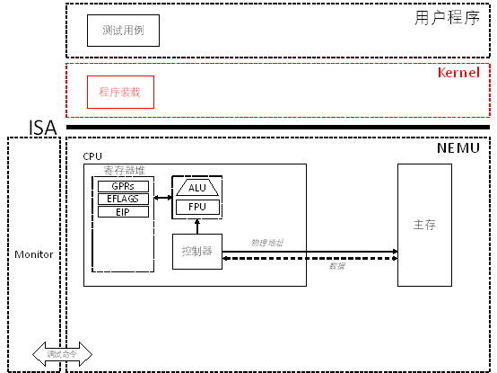

# PA 2-2 装载ELF文件

在上一节中所展开的实现指令的实验中，测试用例的可执行目标文件是通过交叉编译并使用`objcopy`直接得到对应的内存镜像加载到内存中执行的。在真实的计算机系统中，这是一种效率极低的存储可执行文件的方法。现代的类UNIX操作系统，如Linux，主要使用可执行可链接格式（Executable and Linkable Format，简称ELF）来存储目标文件。本节我们就目标文件的装载展开讨论。



图2-4 PA 2-2路线图


## §2-2.1 预备知识

#### §2-2.1.1 ELF文件和ELF Header

要实现ELF文件装载，需要先熟悉ELF可执行目标文件的结构。简单来说，对应课本pg. 190，图4.5所示的结构，目前我们可以将ELF可执行目标文件看作由三个部分组成：ELF头、程序头表、其余的ELF文件体。

```
+-------------+-----------------------+--------------------------------------+
| ELF Header  | Program Header Table  | Rest of the ELF File                 |
+-------------+-----------------------+--------------------------------------+

图2-5 ELF文件结构简图
```

ELF头的结构可以通过在控制台中执行`man elf`命令进行查阅，描述如下：

```c
The ELF header is described by the type Elf32_Ehdr or Elf64_Ehdr:
#define EI_NIDENT 16

typedef struct {
    unsigned char e_ident[EI_NIDENT];
    uint16_t      e_type;
    uint16_t      e_machine;
    uint32_t      e_version;
    ElfN_Addr     e_entry;
    ElfN_Off      e_phoff;        // 程序头表在ELF文件中的偏移量
    ElfN_Off      e_shoff;
    uint32_t      e_flags;
    uint16_t      e_ehsize;
    uint16_t      e_phentsize;    // 程序头表中每个表项的大小
    uint16_t      e_phnum;        // 程序头表中包含表项的个数
    uint16_t      e_shentsize;
    uint16_t      e_shnum;
    uint16_t      e_shstrndx;
} ElfN_Ehdr;
```

其中和可执行文件装载相关的三个成员已经给出注释了。事实上，我们只需要使用其中的两个，即，`e_phoff`和`e_phnum`就能够顺利地实现装载。

#### §2-2.1.1 ELF文件的装载

装载的过程简言之就是将ELF文件中的程序和数据段等需要装载到内存中的segment拷贝到内存中合适位置的过程。在ELF文件中存储了一个数组，叫做程序头表（program header table），其在ELF文件中偏移量由ELF Header中的`e_phoff`域给出。程序头表中每一项的结构可以通过`man elf`命令进行查看，摘录如下：

```c
typedef struct {
    uint32_t   p_type;
    Elf32_Off  p_offset;
    Elf32_Addr p_vaddr;
    Elf32_Addr p_paddr;
    uint32_t   p_filesz;
    uint32_t   p_memsz;
    uint32_t   p_flags;
    uint32_t   p_align;
} Elf32_Phdr;
```

其中，`p_type`指定了表项的类型，对于类型为`PT_LOAD`类型的表项，我们需要对其进行装载。装载过程可以简述为，对于`p_type == PT_LOAD`的表项，将ELF文件中起始于`p_offset`，大小为`p_filesz`字节的数据拷贝到内存中起始于`p_vaddr`的位置，并将内存中剩余的`p_memsz - p_filesz`字节的内容清零。其过程可以由下图来表示：

```
    +-------+---------------+-----------------------+
    |       |...............|                       |
    |       |...............|                       |  ELF file
    |       |...............|                       |
    +-------+---------------+-----------------------+
    0       ^               |              
            |<------+------>|       
            |       |       |             
            |       |                            
            |       +----------------------------+       
            |                                    |       
 Type       |   Offset    VirtAddr    PhysAddr   |FileSiz  MemSiz   Flg  Align
 LOAD       +-- 0x001000  0x00100000  0x00100000 +0x1d600  0x27240  RWE  0x1000
                             |                       |       |     
                             |   +-------------------+       |     
                             |   |                           |     
                             |   |     |           |         |       
                             |   |     |           |         |      
                             |   |     +-----------+ ---     |     
                             |   |     |00000000000|  ^      |   
                             |   | --- |00000000000|  |      |    
                             |   |  ^  |...........|  |      |  
                             |   |  |  |...........|  +------+
                             |   +--+  |...........|  |      
                             |      |  |...........|  |     
                             |      v  |...........|  v    
                             +-------> +-----------+ ---  
                                       |           |     
                                       |           |    
                                          Memory

图2-6 ELF文件的装载
```

为了更方便地理解一个可执行文件的程序头表的内容，可以通过`readelf`命令查看ELF文件的内容，`readelf`提供了两个视角，一个是面向链接过程的section视角（`readelf -S`），另一个是面向执行的segment视角（`readelf -l`）。在这里我们关注后一个视角即可。通过对比`readelf`所打印出的程序头表和`Elf32_Phdr`所示的程序头表表项结构，不难理解其中的含义。所谓装载的过程即为扫描程序头表，对所有类型为`PT_LOAD`的表项执行上图中所示的装载过程。

总结预备知识中的内容，ELF文件装载的过程如下：

1. 读入位于ELF文件最开始位置（偏移量为`0`）处的ELF头，并根据其中的值`e_phoff`定位程序头表在ELF文件中的位置；

2. 顺序扫描程序头表中的每一个表项，遇到需要装载的表项时，根据表项描述的内容将相应的数据拷贝到内存相应位置。

## §2-2.2 代码导读和实验理解

#### §2-2.2.1 引入Kernel

可执行目标文件的格式是由操作系统定义的。自然地，在这里我们也将这一功能实现在一个简单地操作系统之中。从这一节开始，我们引入一个非常精简的操作系统---Kernel，来实现和操作系统有关的系统功能的实现。Kernel的代码位于和NEMU平行的目录中名为`kernel/`的文件夹之下。

我们的实验主要围绕NEMU展开，核心是系统的功能模拟。引入Kernel主要是为了完成以下三个方面的功能：

1. 实现可执行目标文件（ELF格式）的装载

2. 实现存储管理对段表和页表的初始化

3. 实现中断处理和I/O相关的操作

以上三点功能正好贯穿从PA 2后期到PA 4的所有内容。在本实验中，我们关心的是第一点功能。

#### §2-2.2.2 使用make testkernel执行测试用例

在之前使用

> make run

或

> make test_pa-2-1

执行测试用例时，NEMU会直接将测试用例的镜像加载到内存`0x30000`开始的模拟内存中，并从第一条指令开始执行。此时的内存划分方式请参照PA 2-1中的论述。

在引入Kernel之后，我们通过命令

> make run-kernel

或者在本阶段使用

> make test_pa-2-2

来加载Kernel进而执行测试用例。此时的内存区段划分与`make run`和`make test_pa-2-1`时的情形非常类似，物理地址`0x00000 ~ 0x30000`区段存放的是测试用例的ELF文件（`testcase/bin/<testcase>`），而从物理地址`0x30000`开始存放的是Kernel的代码和数据：

```
                    Initial EIP
                        |
Physical Address        v
0x0                    0x30000                             
+------------------+---+---------------+-------------------------------------+
|Testcase ELF File | ~ |Kernel Binary  |               ~                     |
+------------------+---+---------------+-------------------------------------+

图2-7 装入Kernel后的内存划分
```

而在本实验中，我们要实现Kernel中位于`kernel/src/elf/elf.c`中的`loader()`函数。我们约定此时测试用例的起始位置位于物理地址`0x100000`。此约定隐含假设Kernel的代码和数据能够存放于物理地址`0x30000 ~ 0x100000`的区间。若空间不够，则需要将测试用例的起始位置设置为更靠后的值。此时内存的划分方和`loader()`的功能功能可由图2-8来描述。

```
                    Initial EIP
                        |
Physical Address        v
0x0                    0x30000             0x100000                
+------------------+---+---------------+---+-------------------+-------------+
|Testcase ELF File | ~ |Kernel Binary  | ~ |Testcase Binary    |      ~      |
+------------------+---+---------------+---+-------------------+-------------+
 +                                          ^
 |                 loader()                 |
 +------------------------------------------+

图2-8 Kernel装载测试用例的ELF文件
```

为配合上述过程，需要修改`testcase/Makefile`中`LDFLAGS`变量的`-Ttext`参数，将其从`0x30000`修改为`0x100000`。实现`loader()`的方案请参照预备知识中描述的过程。

在完成了程序的装载后，`loader()`函数将返回所装载程序（测试用例）的入口地址，该地址由ELF头中的`e_entry`域给出。这个域的取值由`testcase/Makefile`中的链接参数给出，此时我们设置为`0x100000`。当`loader()`返回后，在`kernel/src/main.c`中，我们会记录该入口地址，并在稍后跳转到改地址开始执行测试用例。


## §2-2.3 实验过程及要求     

##### * 代码要求

1. 修改`testcase/Makefile`中`LDFLAGS`并

> make clean

2. 实现Kernel中的`loader()`；

3. 使用

> make test_pa-2-2

执行测试用例并通过。

## 本阶段要修改的代码清单（参考）

* `testcase/Makefile` 
* `kernel/src/elf/elf.c`
