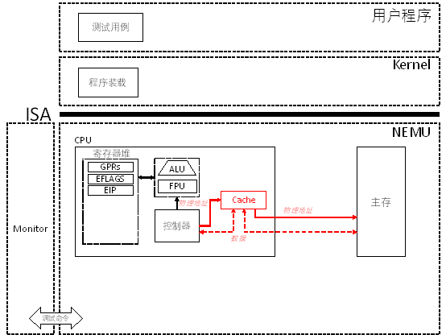

# PA 3-1 Cache的模拟



图3-1 PA 3-1 Cache模拟路线图


在之前的阶段中，我们将指令和数据存放在主存中。在程序的执行过程中，CPU先通过访存操作获取指令和源操作数，执行操作后将结果通过访存操作写入目的操作数。每一条指令的执行都需要进行至少一次访存。

随着大规模集成电路和半导体工艺的进步，CPU变得越来越快。而采用动态随机存取存储器（Dynamic Random Access Memory，DRAM）实现的主存由于其工作原理的限制，其速度难以得到进一步地提高。简单来说，DRAM的存储空间可以看成若干个二维矩阵(若干个bank)，矩阵中的每个元素包含一个晶体管和一个电容，晶体管充当开关的作用，功能上相当于读写使能；电容用来存储一个bit，当电容的电量大于50%，就认为是 1，否则就认为是 0。但是电容是会漏电的，如果不进行任何操作的话，电容中的电量就会不断下降，1最终会变成 0，存储数据就丢失了。为了避免这种情况，DRAM必须定时刷新，读出存储单元的每一个bit，如果表示 1，就往里面充电。DRAM每次读操作都会读出二维矩阵中的一行，由于电容会漏电的特性，在将一行数据读出之前，还要对这一行的电容进行预充电，防止在读出的过程中有的电容电量下降到50%以下而被误认为是 0。

同时，CPU和主存之间需要通过系统总线通过I/O桥接器连接内存总线来交换信息。CPU每次发起对主存的读写都将引起一系列的操作称为总线事务。以读事务为例，首先，CPU将地址放到系统总线上；I/O桥接器将信号传递到内存总线；主存获取内存总线上的地址信号，读取DRAM得到数据字，并将数据写到内存总线；I/O桥接器将数据传递到系统总线；最后CPU才能读取通过系统总线传来的数据。

由此可见，CPU的每次访存都需要进过一系列的信号转换，最后到一个速度受限的DRAM上去完成数据的存取。由于每一条指令的执行都至少需要进行一次访存。如果不采取有效措施，那么系统速度就会卡在DRAM这一个瓶颈上，CPU造的再快也没有效果。那如何提高访存的效率呢？通过上面的论述，我们可以自然地想到从两个地方着手：

1. 采用比DRAM更快的器件，于是我们想到采用无需刷新的静态随机存取存储器（Static Random Access Memory，SRAM）来代替DRAM；

2. 让存储部件离CPU更近一点，我们把SRAM直接放到CPU的芯片里面。

事实表明，这是一种很成功的做法，能够使这一部分SRAM的存取速度相比DRAM提高十几甚至上百倍，CPU能够在几个时钟周期内就完成对SRAM数据的访问。我们将这一部分造在CPU中的SRAM称为高速缓存（Cache）。

那我们还要DRAM干什么？为什么不在CPU芯片内做一个很大的，比如4GB，的SRAM来代替DRAM？因为造不起。SRAM的相对访问时间是DRAM的十分之一，而相对花费却在千倍以上。因此，这一部分造在CPU内部的SRAM只能提供非常有限的存储空间，用来放置一些被频繁使用的数据。CPU访问主存前先访问Cache，如果数据在Cache中（称为Cache命中），则抄近路从Cache取数据；若不在（称为Cache缺失），那只能老老实实去访问主存。因此，如何提高Cache的命中率是Cache设计中的一个核心问题。

## §3-1.1 预备知识

使有限的Cache能够高效存储相对近乎无限的主存空间中的数据并保证较高的命中率，利用的是程序访问地址的**局部性原理（locality）**：

1. 时间局部性：如果程序访问了一个内存区间，那么这个内存区间很有可能在不久的将来会被再次访问，这就是时间局部性。例如循环执行一小段代码, 或者是对一个变量进行读写（addl $1, var需要将var变量从内存中读出, 加1之后再写回内存）；

2. 空间局部性：如果程序访问了一个内存区间，那么这个内存区间的相邻区间很有可能在不久的将来会被访问，这就是空间局部性。例如顺序执行代码，或者是扫描数组元素。

相应地，我们希望利用程序访问地址的局部性来高效的缓存数据：

1. 利用时间局部性原理，Cache将缓存从主存中读出的数据，这样下次再访问的时候就不需要再次访存，而只需从Cache中读取即可；

2. 利用空间局部性原理，每次Cache缓存数据的时候并不是CPU要多少就缓存多少，而是多读一点。Cache和主存之间交换数据的基本单元在主存中称为块（block），而在Cache中则称为行（line）或槽（slot）。

在确立了基本思想之后，要使得Cache能够真正地实现出来，我们还需要解决一系列的具体问题：

1. 主存中的块与Cache中的槽如何对应？在这里就要考虑到查找的效率和Cache存储空间使用效率的权衡。于是就产生了直接映射、全相联映射和组相联映射这三种方式；

2. 当新访问的主存块映射到Cache中已经被占用的槽时怎么办？于是便产生了不同的替换策略如先进先出、最近最少用、最不经常用和随机替换算法等；

3. 当Cache槽中的数据和主存对应块的数据产生不一致时怎么办？这种不一致只会由对Cache的写操作引起，于是针对写操作的不同处理方法就形成了全写法和回写法两类方法。

4. 写操作时Cache缺失时怎么处理？根据是否将内存块调入Cache就形成了包括写分配法和非写分配法两种基本的策略。

对于上述问题的回答没有一个统一的最优答案，在工程实践过程中，每一个策略组合的选择都有其优点和缺陷。每一个设计都是面对多种可能因素的一个权衡。

在现代处理器设计中，不仅仅只有一个cache，还有针对指令的指令cache和针对数据的数据cache，同时cache也往往分为多级，其目的就在于充分利用CPU芯片上有限的空间，在成本和性能间不断取得最优的权衡结果。课本第6.4.7节简要介绍了相关的知识。

## §3-1.2 代码导读和实验理解

在框架代码中我们并没有给出和cache实现相关的样例，你需要自行进行添加。在`include/config.h`中通过定义宏`CACHE_ENABLED`开启对`cache`的模拟。在`nemu/src/memory/memory.c`中，在`paddr_read()`和`paddr_write()`函数里，增加相应的代码来通过cache实现对物理内存的读写：

```c
uint32_t paddr_read(paddr_t paddr, size_t len) 
{
	uint32_t ret = 0;
#ifdef CACHE_ENABLED
		ret = cache_read(paddr, len);     // 通过cache进行读
#else
		ret = hw_mem_read(paddr, len);
#endif
	return ret;
}

void paddr_write(paddr_t paddr, size_t len, uint32_t data) 
{
#ifdef CACHE_ENABLED
		cache_write(paddr, len, data);    // 通过cache进行写
#else
		hw_mem_write(paddr, len, data);
#endif
}

void init_mem()
{
	// clear the memory on initiation
	memset(hw_mem, 0, MEM_SIZE_B);
#ifdef CACHE_ENABLED
	init_cache();                             // 初始化cache
#endif
#ifdef TLB_ENABLED
	make_all_tlb();
	init_all_tlb();
#endif
}

```

在`cache_read()`和`cache_write()`函数中，封装通过cache读写物理内存的逻辑。如cache命中，则直接从cache进行读（写的话根据是否采用直写法进行相应操作）；如cache缺失，则通过`hw_mem_read()`和`hw_mem_write()`接口将主存块调入cache后再写（写缺失的处理根据是否采用写分配法来确定）。

由于NEMU是用软件模拟的cache，因此不可能在物理上达到真正cache硬件的加速性能。为此，你可以通过模拟的计时器来测试cache的性能。如增加一个全局的计时器变量，当cache命中时，为访问时间加上1；而cache缺失时，则为访问时间加上10。最后等测试用例执行完后，比较一下采用cache和不采用cache的模拟执行时间的区别。

## §3-1.3 实验过程及要求

##### * 代码要求

在`include/config.h`中定义宏`CACHE_ENABLED`并`make clean`； 

在NEMU中实现一个cache，它的性质如下:

1. cache block存储空间的大小为64B

2. cache存储空间的大小为64KB

3. 8-way set associative

4. 标志位只需要valid bit即可

5. 替换算法采用随机方式

6. write through

7. not write allocate

你还需要在`nemu/src/memory/memory.c`的`init_mem()`函数中对cache进行初始化，将所有valid bit置为无效即可。实现后，修改`memory.c`中的`paddr_read()`和`paddr_write()`函数，让它们读写cache，当缺失时由cache负责调用`hw_mem_read()`和`hw_mem_write()`读写DRAM。

在完成上述功能后，使用

> make test_pa-3-1

命令进行测试。

## 本阶段要修改的代码清单（参考）

* `include/config.h`
* `nemu/src/memory/mmu/cache.c`
* `nemu/src/memory/memory.c`
