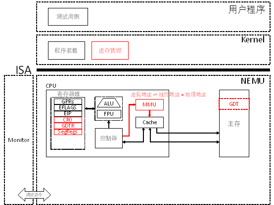

# PA 3-2 保护模式

在之前的阶段中，NEMU始终工作在类似于“实模式”的状态下，简言之，就是程序直接通过物理地址访问主存。从本小节开始，我们开始让NEMU具备现代计算机的内存管理功能。



图3-2 PA 3-2 实现分段机制路线图


## §3-2.1 预备知识

#### §3-2.1.1 8086的实模式

在最早的8086时代，所有的寄存器都是16位的。若地址也是16位的，那么能够寻址的内存大小为2^16 B = 64KB。为了扩展可寻址的空间，8086引入了一系列16位的段寄存器。引入段寄存器后，实际的地址计算方式如下：

```
physical address = (seg_reg << 4) + offset
```

其中，`seg_reg`是某一个段寄存器的值，而<font color=blue>offset</font>则是程序给出的16位的地址偏移量，加起来物理地址的位数总共为20位。如此，便可以寻址2^20 B = 1MB的地址空间，在8086的时代，1MB的内存空间已经是非常巨大了。尽管目前看来，当初的实模式已经不能满足现代计算机的需求。但是有很多设计却一直保留到今天：

首先，约定各段寄存器和`offset`之间的绑定关系如下：

| 偏移量（offset）类型     | 绑定的段寄存器 |
| ------------------------ | -------------- |
| 代码段（对应eip）        | CS             |
| 数据访问                 | DS             |
| 堆栈访问（对应esp和ebp） | SS             |
| 特殊类型访问（如movs）   | ES             |

第二，在系统初始化时，先进入实模式。当完成初始化后，可由程序控制使得机器转入保护模式执行。此举的主要目的就是为了实现新机器对老程序的向下兼容。尽管使得机器设计会变得更为复杂，但是作为一款成功的商业产品，向下兼容是保证新产品能够被市场接受的一个重要条件。

#### §3-2.1.2 80386的保护模式

##### * 保护模式下的寻址过程

在保护模式下，寻址方式会产生变化。简单来说，程序给出的32位地址不再直接解释为物理地址，而是相对于某一个段的偏移量（`offset`）。真正的物理地址由下式给出：

```
physical address = linear address = base address + offset
```


其中的`base address`是一个32位的地址，对应某个段的基地址；而`offset`则是程序给出的32位段内偏移量。在这里我们引入了一个新概念叫线性地址（`linear address`），这个概念直到我们介绍分页机制的时候才会用到。在现阶段，线性地址就等于物理地址（`physical address`）。

```
           15              0    31                                   0
  LOGICAL +----------------+   +-------------------------------------+
  ADDRESS |    SELECTOR    |   |        OFFSET (EFFECTIVE ADDR)      |
          +---+---------+--+   +-------------------+-----------------+

图3-3 48位逻辑地址结构
```

当开启保护模式后，NEMU中运行的程序访在问内存时给出的就不简单是32位的物理地址了，而是由一个16位的段选择符加上32位的段内偏移量（有效地址）所构成的48位的逻辑地址（或称虚拟地址）。由于32位的段内偏移量是由程序直接给出，那唯一的问题就是如何通过16位的段选择符来获取32位的段基地址（`base address`）。在80386中，这一过程通过查表来实现。计算机与操作系统约定，若要开启保护模式，则操作系统需要事先在内存中准备好一个表，叫做“段表”，其中存储好每个段的首地址（`base address`）、段的长度（`limit`）等相关的信息。段表由一系列连续的段表项构成，其中每个段表项都是一个64位的数据结构称为段描述符，其结构如下：

```
DESCRIPTORS USED FOR APPLICATIONS CODE AND DATA SEGMENTS

  31                23                15                7               0
 +-----------------+-+-+-+-+---------+-+-----+-+-----+-+-----------------+
 |                 | | | |A|         | |     | |     | |                 |
 |   BASE 31..24   |G|X|O|V| LIMIT   |P| DPL |1| TYPE|A|  BASE 23..16    | 4
 |                 | | | |L| 19..16  | |     | |     | |                 |
 |-----------------+-+-+-+-+---------+-+-----+-+-----+-+-----------------|
 |                                   |                                   |
 |        SEGMENT BASE 15..0         |       SEGMENT LIMIT 15..0         | 0
 |                                   |                                   |
 +-----------------------------------+-----------------------------------+

           A      - ACCESSED
           AVL    - AVAILABLE FOR USE BY SYSTEMS PROGRAMMERS
           DPL    - DESCRIPTOR PRIVILEGE LEVEL
           G      - GRANULARITY
           P      - SEGMENT PRESENT

图3-4 64位段描述符结构
```

于是整个段表就是多个段表项构成的一个数组：

```
+----------------+
|    SEGMENT     |
|   DESCRIPTOR   |
+----------------+
|    SEGMENT     |
|   DESCRIPTOR   |
+----------------+
|                |
|                |
|                |
|       ...      |
|                |
|                |
+----------------+
|    SEGMENT     |
|   DESCRIPTOR   |
+----------------+

图3-5 段表
```

在48位的逻辑地址中，包含了16位的段选择符，一个段选择符的结构如下：

```
15                        3 2   0
+-------------------------+-+---+
|                         |T|   |
|           INDEX         | |RPL|
|                         |I|   |
+-------------------------+-+---+

TI  - TABLE INDICATOR
RPL - REQUESTOR'S PRIVILEGE LEVEL

图3-6 16位段选择符结构
```

如上图所示的段选择符存储在段寄存器的可见部分，由三个部分组成：高13位是一个`index`，用于指出所访问段的段描述符是段表中的第几项（数组下标）；`TI`用于指出选择哪一个段描述符表，`TI`为0时表示选择全局描述符表（GDT），`TI`为1时表示选择局部描述符表（LDT），在NEMU中，我们只关注GDT；最后`RPL`则与访问权限控制有关，在NEMU中，我们不模拟权限管理，但会在本节最后进行一些讨论。

结合虚拟地址、段选择符和段表的相关概念，在分段机制中，将虚拟地址转换成线性地址（此时即为物理地址）的过程可描述如下：

1. 根据段选择符中的`TI`位选择GDT或LDT（NEMU中永远是GDT）；

2. 根据段选择符中的`index`部分到GDT中找到对应位置上的段描述符；

3. 读取段描述符中的`base`部分，作为32位段基址，加上32位段内偏移量获取最终的物理地址。

在此过程中，我们还需要一项关键信息，那就是段表GDT的首地址。这一项关键信息保存在CPU中的一个特殊寄存器`GDTR`中。该寄存器中保存了GDT的首地址（线性地址）和界限，由操作系统在系统初始化时填入 ，并对用户程序不可见。上述过程也可以由下图说明：

```
           15              0    31                                   0
  LOGICAL +----------------+   +-------------------------------------+
  ADDRESS |    SELECTOR    |   |                OFFSET               |
          +---+---------+--+   +-------------------+-----------------+
       +------+         V                          |
       | DESCRIPTOR TABLE      +---------+         |
       |  +------------+ <---  |GDTR.BASE|         |
       |  |            |       +---------+         |
       |  |            |                           |
       |  |            |                           |
       |  |            |                           |
       |  |------------|                           |
       |  |  SEGMENT   | BASE          +---+       |
       +->| DESCRIPTOR |-------------->| + |<------+
          |------------| ADDRESS       +-+-+
          |            |                 |
          +------------+                 |
                                         V
              LINEAR  +------------+-----------+--------------+
              ADDRESS |    DIR     |   PAGE    |    OFFSET    |
                      +------------+-----------+--------------+

图3-7 从逻辑地址到线性地址（此时即为物理地址）的转换
```

##### * 从实模式切换到保护模式

如前所述，计算机在刚启动时进入的是实模式。在实模式下，操作系统需要完成包括初始化段表（如`GDT`）和描述符表寄存器（如`GDTR`）。在初始化完成后，操作系统通过将0号控制寄存器（`CR0`）中的`PE`位置为1的方式，来通知机器进入保护模式。在此之前，`CR0`中的`PE`初始化为0。`CR0`寄存器的结构请自行参阅i386手册的相关内容。

## §3-2.2 代码导读和实验理解

在NEMU中实现保护模式需要Kernel和NEMU配合完成保护模式的初始化。在PA中，为了开启保护模式相关的功能，我们首先需要在`include/config.h`头文件中添加宏定义`#define IA32_SEG`。

#### §3-2.2.1 Kernel的行为改变

在重新`make`之后（可能需要先执行`make clean`），这将引起Kernel和NEMU行为的一些变化。对于Kernel而言，其行为改变发生在`kernel/start/start.S`中：

1. 通过`lgdt`设置全局描述符表

2. 将`CR0`寄存器的`PE`位置为1开启保护模式

3. 使用`ljmp`指令装载`CS`段寄存器

4. 通过`mov`指令初始化`DS`, `ES`, `SS`段寄存器；

5. 转入后续执行。

我们约定NEMU工作在扁平模式，即所有段的基地址都为0x0，界限为全1。这一点体现在`kernel/start/start.S`所准备的段表gdt中。

#### §3-2.2.2 NEMU的进化

为了实现保护模式，NEMU首先需要模拟相应的器件。在`nemu/include/cpu/reg.h`头文件中，我们要为`CPU_STATE`结构添加上必要的器件模拟，其中包括`GDTR`、`CR0`和长度为6的段寄存器数组`SegReg[]`。其中，`GDTR`的类型为一个`struct`，包含16位的`limit`和32位的`base`两个部分。`CR0`寄存器的结构参照i386手册，其中最关键的是要包含`PE`位，后续到分页机制阶段，则需要利用到`CR0`中的`PG`位。你可以参照`EFLAGS`的实现方法来实现`CR0`。段寄存器结构体类型`SegReg`除了在其可见部分保存了段选择符以外，还在其不可见部分缓存了对应段描述符中的关键信息如`base`和`limit`，可参照i386手册或课本第274页图6.38的描述。参考实现代码：

```c
typedef struct {
	uint32_t limit :16;
	uint32_t base :32;
}GDTR;

typedef union {
	struct {
		uint32_t pe :1;
		uint32_t mp :1;
		uint32_t em :1;
		uint32_t ts :1;
		uint32_t et :1;
		uint32_t reserve :26;
		uint32_t pg :1;
	};
	uint32_t val; 	
}CR0;

typedef struct {
	// the 16-bit visible part, i.e., the selector
	union {
		uint16_t val;
		struct {
			uint32_t rpl :2;
			uint32_t ti :1;
			uint32_t index :13;
		};
	};

	// the invisible part, i.e., cache part
	struct {
		uint32_t base;
		uint32_t limit;
		uint32_t type :5;
		uint32_t privilege_level :2;
		uint32_t soft_use :1;
	};
}SegReg;
```

如果采用上述命名约定，在实现了各个寄存器的类型后，在为`CPU_STATE`结构中就可以通过添加类似如下的代码来实现对器件的模拟了。

```c
GDTR gdtr; // GDTR
union { // segment registers
	SegReg segReg[6];
	struct { SegReg es, cs, ss, ds, fs, gs; };
};
CR0 cr0; // control register 0
```

在实现了对器件的模拟之后，可以对NEMU在访问内存时的行为进行相应的调整。所涉及的代码主要包含在`nemu/src/memory/`文件夹下。

首先，NEMU需要针对保护模式中的分段机制提供地址翻译的功能。这部分功能的代码包含在`nemu/src/memory/mmu/segment.c`的`segment_translate()`函数中。这个函数包含两个参数，分别是32位的有效地址（即段内偏移量）`offset`，和段寄存器的编号`sreg`。要实现这个函数的功能是非常简单的：

1.使用`sreg`作为编号查询CPU中的`SegReg`段寄存器数组；

2.读出其隐藏部分的`base`，将其与`offset`相加并返回结果即可。

第二，段寄存器的隐藏部分怎么来？我们注意到在系统初始化完成后，每个段的`base`和`limit`一般不会发生变化（在扁平模式下更是如此）。因此，只需要在每个段寄存器在初始化时将对应段的`base`和`limit`等信息装入段寄存器的隐藏部分即可一劳永逸。那么段寄存器在何时初始化？观察Kernel的行为，发现只有`ljmp`和目的操作数为段寄存器的`mov`指令才会引起段寄存器内容发生变化（在后面实现到中断的时候，我们会发现CPU在响应中断和异常时也会引起段寄存器的内容发生改变，但这是后话了）。因此，在实现`ljmp`和`mov`指令时，需要同时完成对段寄存器隐藏部分的加载，在框架代码中，这个过程可以通过调用`load_sreg()`函数来实现。`load_sreg()`函数定义在`nemu/src/memory/mmu/segment.c`中，其参数是需要装载的段寄存器的编号，需要完成的工作是根据段寄存器在`ljmp`和`mov`指令的操作数中给出的`index`查询段表并完成隐藏部分的装填。注意`GDTR`中保存的基地址是线性地址。

在`nemu/include/memory/mmu/segment.h`中，我们已经准备好了段表项的数据结构`SegDesc`。在`load_sreg()`中，建议通过`assert`针对扁平模式下`base`等于0，`limit`为全1，`granularity`为1等条件进行检查，以尽早暴露可能的错误。

第三，有了上述功能的支持，我们就可以在`memory.c`中为NEMU添加分段机制了。修改`vaddr_read()`和`vaddr_write()`函数的实现，当`CR0`的`PE`位为1时，通过我们实现好的`segment_translate()`函数将逻辑地址翻译成线性地址再进行下一层的内存访问。在这里，将`vaddr_read()`和`vaddr_write()`传入的参数`vaddr`直接作为`offset`传给`segment_translate()`函数即可。此时`vaddr`已经转义为有效地址了，请理解这一区别。

最后，不要忘记在CPU初始化时（在`nemu/src/cpu/cpu.c`的`init_cpu()`），将`CR0`和`GDTR`初始化为全0。

## §3-2.3 实验过程及要求

##### * 代码要求

1. 在`include/config.h`头文件中添加宏定义`IA32_SEG`并`make clean`；

2. 在`CPU_STATE`中添加对`GDTR`、`CR0`的模拟以及在`init_cpu()`中进行初始化为0；

3. 在`CPU_STATE`中添加对6个段寄存器的模拟在`init_cpu()`中进行初始化为0，注意除了要模拟其16位的可见部分，还要模拟其隐藏部分，顺序不能有错；

4. 实现包括`lgdt`、针对控制寄存器和段寄存器的特殊`mov`以及`ljmp`指令；

5. 实现`segment_translate()`、`loag_sreg()`函数，并在`vaddr_read()`和`vaddr_write()`函数中添加保护模式下的虚拟地址向线性地址转换的过程；

6. 通过`make test_pa-3-2`执行并通过各测试用例。

## 本阶段要修改的代码清单（参考）

* `include/config.h` 
* `nemu/include/cpu/reg.h`
* `nemu/include/cpu/instr/lgdt.h`
* `nemu/src/cpu/instr/lgdt.c`
* `nemu/include/cpu/instr/mov.h`
* `nemu/src/cpu/instr/mov.c`
* `nemu/include/cpu/instr/jmp.h`
* `nemu/src/cpu/instr/jmp.c`
* `nemu/src/memory/memory.c`
* `nemu/src/memory/mmu/segment.c`
* `nemu/src/cpu/decode/opcode.c`


## §3-2.4 延伸阅读：特权等级

在上述实现分段机制的实验中，我们仅仅讨论了使用段表完成从逻辑地址到线性地址的转换。而事实上当工作在扁平模式下的时候，这种转换没有起到什么作用，其保护的意味并不明显。然而在我们编写程序的过程中，如果访问了错误的内存地址，机器还是抛出“段错误”，这又是怎么做到的呢？这就需要谈谈80386中所引入的特权等级的概念。回忆图3-4中所给出的段描述符结构和图3-6中给出的段选择符结构，我们发现它们分别拥有2比特的DPL（Descriptor Privilege Level）和RPL（Requestor's Privilege Level）域，分别指出了一个段所在的特权级，以及请求者所在的特权级。除此以外，还有一个CPL（Current Privilege Level）用于指出当前进程的特权级, 一般来说它和当前CS寄存器所指向的段描述符(也就是当前进程的代码段)的DPL相等。

既然标识特权等级的DPL、RPL和CPL都是两位的，自然就一共能够表示0、1、2、3四个特权等级，其中特权等级0为最高，等级3为最低。低等级能够访问的资源，在高等级中都能够访问。于是按照能够获取相应等级的程序类型来划分，就可以将特权等级划分成不同的环。在相应的术语体系中，分别称之为ring 0一直到ring 3。Ring 0一般只给操作系统内核使用，而ring 3则属于普通的应用程序。在大多数的通用操作系统中，往往只使用ring 0和ring 3就足够了。

```
               +-----------------------------------------------+ 
               |                 APPLICATIONS                  | 
               |     +-----------------------------------+     | 
               |     |        CUSTOM EXTENSIONS          |     | 
               |     |     +-----------------------+     |     | 
               |     |     |    SYSTEM SERVICES    |     |     | 
               |     |     |     +-----------+     |     |     | 
               |     |     |     |  KERNAL   |     |     |     | 
               |-----+-----+-----+-----+-----+-----+-----+-----| 
               |     |     |     |     |RING |RING |RING |RING | 
               |     |     |     |     |  0  |  1  |  2  |  3  | 
               |     |     |     +-----+-----+     |     |     | 
               |     |     |           |           |     |     | 
               |     |     +-----------+-----------+     |     | 
               |     |                 |                 |     | 
               |     +-----------------+-----------------+     | 
               |                       |                       | 
               +-----------------------+-----------------------+ 
```

80386会在段寄存器更新的时候(也就是切换到另一个段的时候)进行特权级的检查。以数据段为例，当一个程序要访问内存中的数据时，它必须要事先装载DS, ES, FS, GS, SS中的某一个段寄存器。此时，处理器会自动进行特权级的检查：当且仅当从数值上
```
target_descriptor.DPL >= requestor.RPL


target_descriptor.DPL >= current_process.CPL
```

这两个条件同时满足时，段的切换才是合法的。在实际的执行过程中，`requestor`一般是用户进程，而`current_process`则往往是操作系统内核。当用户进程需要针对数据进行一些自己没有权限的操作时，就会委托操作系统内核来帮助其完成操作。这时处理就会自动执行上述两条检查：1）确保用户进程有权对数据进行操作（`target_descriptor.DPL >= requestor.RPL`）；2）用户进程所委托的对象有权对数据进行操作（`target_descriptor.DPL >= current_process.CPL`）。

违反上述第一条规则的例子是：用户进程试图对操作系统的核心数据（比如段表）进行修改。而违反第二条规则的例子则是：操作系统内核（可能被攻击后）委托一个用户进程来对自己的核心数据进行操作。

80386所引入的保护机制还有很多，感兴趣的同学可以参见i386手册Chapter 6的相关内容。在PA实验中，我们不强调对保护机制的实现，因此所有的程序都工作在最高权限，ring 0中。目前我们只要理解相关的概念，并且知道在现行的机器上，不同的程序拥有不同的权限即可。到操作系统实验的阶段，会引入针对不同特权等级的实验。
