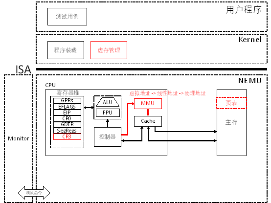

# PA 3-3 分页机制 & 虚拟地址转换

在上一节中，我们实现从逻辑地址到线性地址的转换。在实现分页机制之前，线性地址就当做物理地址使用。而自从80386开始，计算机又提供了一种全新的存储管理方式，那就是分页机制。在分页机制下，每一个进程都拥有独立的存储空间。同时，每一个进程独立的存储空间又具有相同的地址划分方式。此时，线性地址就需要通过进一步的转换，才能获得最终要访问的物理地址。



图3-8 PA 3-3 虚拟存储模拟路线图


## §3-3.1 预备知识

在采用虚拟存储技术的计算机系统中，每一个进程都拥有自己独立的虚拟地址空间。对于32位的系统而言，每个进程独立的虚拟地址空间就是`0x00000000 ~ 0xFFFFFFFF`共4GB。在80386这样的分页式虚拟存储中，主存地址和虚拟地址空间都被划分成大小相等的页面，在虚拟地址空间中的页面称为虚拟页，而对应的在主存空间中的页面称为物理页。在x86系统中，规定每个页面的大小为2^12 = 4KB。于是一个进程的整个虚拟地址空间就被划分成1M = 2^20 = 1024*1024个虚拟页。

 

虚拟页（无论属于哪一个进程）和物理页之间存在一一对应的关系。这种对应关系由进程的页表来维护。与段表类似，页表也是一个由页表项构成的数组。每个页表项是一个占32位的结构体，包含了装入位、修改位、使用位、访问权限、禁止缓存等标志位，最关键地，它包含了某一个虚拟页映射到主存中的哪一个物理页这个关键信息（课本上称为存放位置）。某一个页表项的结构如下图所示：

```
 31                                  12 11                      0
+--------------------------------------+-------+---+-+-+---+-+-+-+
|                                      |       |   | | |   |U|R| |
|     PAGE FRAME ADDRESS 31..12        | AVAIL |0 0|D|A|0 0|/|/|P|
|                                      |       |   | | |   |S|W| |
+--------------------------------------+-------+---+-+-+---+-+-+-+
P - PRESENT
R/W - READ/WRITE
U/S - USER/SUPERVISOR
D - DIRTY
AVAIL - AVAILABLE FOR SYSTEMS PROGRAMMER USE
NOTE: 0 INDICATES INTEL RESERVED. DO NOT DEFINE.

图3-9 32位页表项结构
```


与段描述符中的段基地址不同，32位系统中，页表项中的物理页存放位置指向的是主存中对应的20位物理页号（或称页框号）。若物理页号为0，则表示该页没有调入主存。这里体现出分页机制和分段机制一个很大的区别：在分页机制下，所寻址的物理页不一定在主存中，而可能位于磁盘上。这种允许用磁盘来扩展存储主存中数据的方式大大提高了系统的处理能力。

每个进程都有自己独立的页表来描述该进程的虚拟地址空间和物理地址空间之间的映射关系。从较为直观的角度来说，一个32位的线性地址可以分为两个部分：高20位指出该线性地址属于哪一个虚拟页，而低12位则指出该地址具体指向的字节在该虚拟页内的偏移量是多少。若参照段表的组织方式，将所有2^20个页表项都按顺序存放在一个数组中。那么地址转换的过程就可以简单地表达为：使用线性地址中的高20位作为索引，查找页表；提取对应页表项中的物理页号，加上线性地址中低12指出的页内偏移量；便能够获取对应的物理地址了。

```
         31        22 21       12 11           0
LINEAR  +------------+-----------+--------------+
ADDRESS |    DIR     |    PAGE   |   OFFSET     |
        +------------+-----------+--------------+
        
图3-10 32位线性地址结构
```


基本的设计思路就是这样，只不过在具体实现的时候还会遇到一些小麻烦。2^20个32位的页表项如果要组成一个连续的数组，则需要开辟4MB也就是1024个连续的4KB大小的物理页来进行存储。这显然是难以实现的。因此，一个简单的处理方案就是把页表拆成两级。第一级称为页目录，由1024个类似页表项的页目录项构成。每个页目录项包含一个物理页号，其所指向的物理页中存储了1024个第二级的页表项。如此，2^20个页表项就被拆分成两级，可以存储在1 + 1024个物理页中。这样就大大增加了存储页表的灵活性。在二级页表结构下，一个32位的线性地址就可以被分成三个部分，高10位的页目录索引，中间10位的页表索引和最低12位的页内偏移量。

线性地址向物理地址转换的过程可以由下图表示。

```
                                                              PAGE FRAME
              +-----------+-----------+----------+         +---------------+
              |    DIR    |   PAGE    |  OFFSET  |         |               |
              +-----+-----+-----+-----+-----+----+         |               |
                    |           |           |              |               |
      +-------------+           |           +------------->|    PHYSICAL   |
      |                         |                          |    ADDRESS    |
      |   PAGE DIRECTORY        |      PAGE TABLE          |               |
      |  +---------------+      |   +---------------+      |               |
      |  |               |      |   |               |      +---------------+
      |  |               |      |   |---------------|              ^
      |  |               |      +-->| PG TBL ENTRY  |--------------+
      |  |---------------|          |---------------|
      +->|   DIR ENTRY   |--+       |               |
         |---------------|  |       |               |
         |               |  |       |               |
         +---------------+  |       +---------------+
                 ^          |               ^
+-------+        |          +---------------+
|  CR3  |--------+
+-------+

图3-11线性地址向物理地址转换的过程
```


## §3-3.2 代码导读和实验理解

通过修改`include/config.h`头文件在其中定义宏`IA32_PAGE`来开启对分页机制的模拟。

#### §3-3.2.1 修改Makefile中的链接选项

需要对Kernel和testcase的`Makefile`也要进行相应的调整。具体而言：

1. 修改`kernel/Makefile`，将`LDFLAGS`中的`-Ttext=0x30000`修改为虚拟地址空间中的位置。在Linux系统中，约定高于虚拟地址`0xc0000000`（7个0）的空间为操作系统内核区。为配合这一约定，我们将Kernel在虚拟地址空间中的起始地址设为在原物理地址的基础上加上`0xc0000000`，即，修改`-Ttext=0x30000`为`-Ttext=0xc0030000`；

2. 修改`testcase/Makefile`，去掉`LDFLAGS`中之前对于`-Ttext`的设置，使得测试用例的的只读数据和代码段从虚拟地址`0x8048000`以上开始，符合Linux虚拟地址空间的约定。

#### §3-3.2.2 Kernel行为的改变

在开启`IA32_PAGE`后Kernel的行为会发生较大的改变。具体而言：

1. 在`kernel/start/start.S`中定义的`va_to_pa`宏将产生实质性的作用，会将输入的虚拟地址减去`KOFFSET=0xc0000000`，从而转换成物理地址。这里使用到了我们先前对于Kernel地址偏移量的约定；

2. 在`kernel/src/main.c`源文件中的`init()`函数里，会调用`init_page()`函数来初始化Kernel的页表；

3. 页表初始化完成后，将`ESP`寄存器的值加上`KOFFSET`使其指向虚拟地址空间中的栈，并且使用`ljmp`来将`EIP`置为下一条指令在虚拟地址空间中的地址（注意此处有一个和编译器有关的诡异程序行为变化。若采用gcc-4.x编译，`ljmp`会自动跳转到虚拟地址空间。而采用gcc-6编译的话，跳转地址仍然停留在原先的物理地址。在框架代码中我们做了一个简单的修补，即将跳转地址加上`KOFFSET`，请同学根据编译器的具体编译结果选择是否加上`KOFFSET`）;

4. 在进入到`init_cond()`函数继续初始化后，将调用`init_mm()`函数为用户进程初始化页表的内核映射部分；

5. `loader()`的行为要发生相应的改变，此时`program header`中的`p_vaddr`就真的是用户进程的虚拟地址了, 但它并不在Kernel的虚拟地址空间中, 所以Kernel不能直接访问它。Kernel要做的事情就是:

   1) 按照`program header`中的`p_memsz`属性, 为这一段segment分配一段不小于`p_memsz`的物理内存；

   2) 根据虚拟地址`p_vaddr`和分配到的物理地址正确填写用户进程的页目录和页表；

   3) 把ELF文件中这一段segment的内容加载到这段物理内存；

用户进程在将来使用虚拟地址访问内存，在Kernel为用户进程填写的页目录和页表的映射下，虚拟地址被转换成物理地址，通过这一物理地址访问到的物理内存，恰好就是用户进程想要访问的数据。物理内存并不是可以随意分配的，如果把Kernel正在使用的物理页分配给用户进程，将会发生致命的错误。NEMU模拟的物理内存只有128MB, 我们约定低16MB的空间专门给Kernel使用，剩下的112MB供用户进程使用，即第一个可分配给用户进程的物理页首地址是` 0x1000000`。 不过这一部分的内容实现起来会涉及很多细节问题, 出现错误是十有八九的事情. 为了减轻大家的负担, 我们已经为大家准备了一个内存分配的接口函数`mm_malloc()`其函数原型为:

```c
uint32_t mm_malloc(uint32_t va, int len);
```

它的功能是为用户进程分配一段以虚拟地址` va `开始，长度为` len `的连续的物理内存区间，并填写为用户进程准备的页目录和页表，然后返回这一段物理内存区间的首地址。由于` mm_malloc() `的实现和操作系统实验有关，我们没有提供 `mm_malloc() `函数的源代码，而是提供了相应的目标文件`mm_malloc.o`，`Makefile`中已经设置好相应的链接命令了, 你可以在` loader() `函数中直接调用它, 完成上述内存分配的功能。

#### §3-3.2.3 NEMU的升级

在开启分页机制之后，NEMU的行为也会发生一定的改变。

首先，当然是要在`CPU_STATE`中添加`CR3`寄存器，其结构比较简单直接，查阅i386手册即可。

第二，改变NEMU对线性地址读写的处理方法。其改变集中在`memory.c`中对线性地址读写的处理上。在`nemu/include/memory/mmu/page.h`中，框架代码准备了页目录和页表项的数据结构供程序使用。查询页目录和页表将线性地址翻译为物理地址的过程对应`nemu/src/memory/mmu/page.c`的`page_translate()`函数，你需要填上`#ifndef TLB_ENABLED`直至`#else`之间的部分，这部分对应使用线性地址中的`dir`和`page`部分去查询页目录和页表，然后将页框号加上`offset`获取物理地址的过程。注意`CR3`寄存器和页目录项中保存的基地址都是物理地址。

`laddr_read()`和`laddr_write()`的行为也要发生改变：当`CR0`的`PG`位被置为1时，需要按照上一小节中所述的方法，查询两级页表，将线性地址转换成物理地址再加以访问。注意在`laddr_read()`和`laddr_write()`中要处理地址访问跨越页边界的情形，若发生跨越页边界，则应当将一次读写拆分成两次物理地址读写来进行。在NEMU中，我们不会发生缺页的情况，因此，在进行`page_translate()`时，建议添加对页目录项和页表项中`present==1`的检查，若出现`present`为0，则一定是页级地址转换出了问题。若不做相应检查，代码可能会变得非常难以调试。

#### §3-3.2.4 TLB简述

由于页表是放在主存中的，那意味着每次进行页级地址转换时我们都要去主存访问页表，将线性地址转换为物理地址后再进行访问。这显然引入了可观的额外开销。其解决方案也非常直接，针对页表再做一个cache。于是便有了快表TLB。在框架代码中我们给出了TLB的一个模拟实现，大家可以结合课堂内容对该实现进行理解。在实验课中，我们就不针对TLB设计更深入的实验内容了。

可以在`include/config.h`中通过定义宏`TLB_ENABLED`来开启NEMU对快表的模拟，有兴趣的同学可以观察学习相应的代码。

## §3-3.3 实验过程及要求

##### * 代码要求

1. 修改Kernel和testcase中`Makefile`的链接选项；

2. 在`include/config.h`头文件中定义宏`IA32_PAGE`并`make clean`；

3. 在`CPU_STATE`中添加`CR3`寄存器；

4. 修改`laddr_read()`和`laddr_write()`，适时调用`page_translate()`函数进行地址翻译；

5. 修改Kernel的`loader()`，使用`mm_malloc`来完成对用户进程空间的分配；

6. 通过`make test_pa-3-3`执行并通过各测试用例。

## 本阶段要修改的代码清单（参考）
* `include/config.h`
* `nemu/include/cpu/reg.h`
* `nemu/src/memory/memory.c`
* `nemu/src/memory/mmu/page.c`
* `kernel/src/elf/elf.c`
* `kernel/Makefile`
* `testcase/Makefile`


