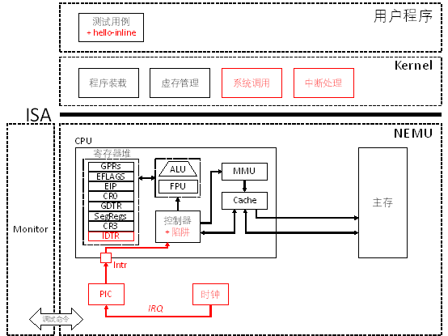

# PA 4-1 异常和中断的响应

在之前的程序执行过程中，我们都遵循着指令按序执行，遇到跳转指令则跳转到目的地址的次序来执行指令。这种执行指令的序列所得到的是正常控制流。而在程序正常执行的过程中，CPU经常会遇到来自内部的异常事件或者外部的中断事件而打断原来程序的执行，转而执行操作系统提供的针对这些事件的处理程序。此时形成的控制流就称为异常控制流。这些打断程序正常执行的事件就称为异常或中断。



图4-1 PA 4-1异常和中断响应路线图


## §4-1.1 预备知识

#### §4-1.1.1 异常和中断的类型和两阶段处理

从80286开始，Intel统一把由CPU内部产生的意外事件，即，“内中断”称为异常；而把来自CPU外部的中断请求，即，“外中断”称为中断。而内部异常又分为三类：

1. 故障：与指令执行相关的意外事件，如“除数为0”、“页故障”等；

2. 陷阱：往往用于系统调用；

3. 终止：指令执行过程中出现的严重错误。

在本实验中，我们对于内部异常，只关注“陷阱”这一类。对于“故障”和“终止”这两类异常不做模拟，若遇到相应的情况，在NEMU中直接通过assert(0)强行停止模拟器运行。

异常和中断的响应和处理过程可分为两个阶段：第一阶段，CPU对异常或中断进行响应，打断现有程序运行并调出处理程序；第二阶段，由操作系统提供的异常或中断处理程序处理完异常事件后返回用户程序继续执行。

#### §4-1.1.2 由硬件执行的第一阶段

其中第一阶段，CPU对异常和中断的响应过程分为以下三个步骤：

1. 保护断点和程序状态：依次将`EFLAGS`、`CS`、`EIP`寄存器压栈；

2. 关中断：当异常事件是外部中断时，清除`EFLAGS`中的`IF`位；否则不清除；

3. 识别异常和中断事件并转相应的处理程序执行：根据指令或硬件给出的异常和中断类型号，查询中断描述符表（`IDT`）得到处理程序的入口地址并跳转执行；

以上三个步骤中的前两个步骤比较简单直观，第三步需要借助中断描述符表来完成。

开机后系统首先工作在实模式下。此时系统采用中断向量的方式，由`BIOS`在主存的物理地址` 0x00000 ~ 0x003FF `的区域建立中断向量表并提供中断服务程序。当系统完成初始化进入保护模式后，中断向量表随即失效，转而使用操作系统提供的中断描述符表来处理各类异常事件。在此处我们本着简化的原则，只针对中断描述符表展开讨论。

与段表的构造非常类似，中断描述符表是一个由门描述符所构成的数组。该数组中的每一个元素（或称表项）都是一个门描述符。门描述符分为三大类：中断门描述符、陷阱门描述符和任务门描述符。具体每一种门描述符的形式请自行参阅i386手册。

与`GDT`类似，门描述符表（`IDT`）的首地址储存在一个特殊的寄存器`IDTR`中。当一个异常或中断到来时，CPU根据异常或中断号，该异常或中断号可能由硬件给出（如，14号页故障），也可能由程序给出（如，`int 0x80`）。得到异常或中断号后，CPU根据该号码查询`IDT`，从对应的门描述符中提取出处理程序的入口地址（虚拟地址，`selector + offset`），并跳转处理程序继续执行。更为详细的过程请仔细查阅i386手册Chapter 9的相关内容

完成上述第三步后，程序的下一条指令就位于操作系统提供的处理程序了，于是进入第二阶段，由操作系统软件完成的对异常和中断的处理。

#### §4-1.1.3 由软件执行的第二阶段

CPU通过根据异常和中断号查询`IDT`获得处理程序的入口地址。跳转到入口地址后，操作系统提供的处理程序会完成第二阶段的处理：

1. 根据操作处理过程的需要，通过`pusha`等指令保存程序执行的现场；

2. 处理相应的异常或中断；

3. 处理完成后，Kernel使用`popa`等指令恢复现场；

4. 通过`iret`指令恢复最初被保护的程序断点和状态信息，返回原程序被中断的指令（或下一条，根据保护断点时具体保存的`EIP`决定）继续执行。

以上便是操作系统软件在第二阶段处理异常和中断的过程，不管是内部异常还是外部中断，其过程都非常类似。

## §4-1.2 代码导读和实验理解

框架代码已经实现了针对异常和中断的大部分代码。为了在实验中开启针对异常和中断的响应，我们首先需要在`include/config.h`头文件中定义宏`IA32_INTR`。定义了这个宏之后，会引起Kernel和NEMU的一些行为变化，有一些作为实验的组成部分，需要我们完善当前的框架代码。

#### §4-1.2.1 Kernel初始化过程

在开启`IA32_INTR`之后会引起Kernel的行为变化，

首先，在`kernel/start/start.S`的第一句，会通过`cli`指令关中断，直至`IDT`初始化完成后才会通过`sti`指令开中断。这是因为在`IDT`完成初始化前，Kernel无法对中断进行正确的响应。

接着，Kernel会在`init_cond()`函数中完成两项工作：

首先、重新初始化`GDT`。因为在开启了分页机制后，原来在`kernel/start/start.S`中初始化的`GDT`已经无法访问了。在开启中断机制之前，由于可以通过各个段寄存器的隐藏部分来获取相关信息而无需查询段表，所以我们的代码没有出现问题。而开启中断机制后，在穿越门描述符时，会引起上下文切换，即将门描述的`selector`装载到`CS`寄存器，如此就会重新引起访问`GDT`的需要。

第二、设置`IDT`。这是Kernel为异常和中断处理所做的核心准备工作。具体来说就是填写`IDT`中每一个门描述符, 设置完毕后通过`lidt`指令装载`IDTR`。相关的代码在`kernel/src/irq/`文件夹下，涉及`IDT`的初始化以及在§4-1.1.3中提到的第二阶段异常和中断请求处理函数的实现。

完成这两项工作后，Kernel已经准备好要处理各类异常和中断事件了。而此时我们的NEMU尚未做好充分的准备。

#### §4-1.2.2 为NEMU添加异常和中断支持

##### * 为软件提供支持

为了配合Kernel实现异常和中断处理功能，在NEMU中我们也要展开相应的工作。

首先，在Kernel初始化`IDT`的`init_idt()`函数的结尾处，Kernel要将初始化的`IDT`首地址通过`lidt`指令装载到`IDTR`中以供CPU查询使用。因此，需要添加`IDTR`和`lidt`指令, 注意`IDTR`中存放的`IDT`首地址是线性地址；

第二，在Kernel处理异常和中断并返回的过程中（观察`kernel/start/start.S`源文件），需要使用包括`pusha`、`popa`、`iret`等指令，需要添加到NEMU提供的指令集中。

同时，针对用户程序，需要在NEMU中添加` int`、`cli`等指令。

##### * 实现由硬件执行的第一阶段响应过程

§4-1.1.2中提到的硬件响应异常和中断分三个主要步骤。在NEMU中，这三个步骤都由位于源文件`nemu/src/cpu/intr.c`中的`raise_intr()`函数来实现，其原型为：

```c
void raise_intr(uint8_t intr_no) {
    // Trigger an exception/interrupt with 'intr_no'
    // 'intr_no' is the index to the IDT
    // Push EFLAGS, CS, and EIP
    // Find the IDT entry using 'intr_no'
    // Clear IF if it is an interrupt
    // Set EIP to the entry of the interrupt handler
}
```

对于内部通过`int`指令产生的自陷，会通过位于同一源文件中的`raise_sw_intr()`函数调用`raise_intr()`来唤出操作系统。而对于来自外部的中断，则需要CPU在每个指令执行的结束后查看中断引脚信号和IRQ请求号后调用`raise_intr()`来跳转到处理程序。

##### * 利用自陷实现系统调用

运行`hello-inline`测试用例。在该测试用例中，我们使用自陷指令`int $0x80`来唤出操作系统。这一条自陷指令起到的作用就是系统调用。系统调用的参数依照约定储存在通用寄存器中，其中`eax = 4`指出系统调用号为4，含义是`SYS_Write`；`ebx = 1`是文件描述符，指出写的目标是标准输出`stdout`；`ecx`中保存的是待输出字符串的首地址；而`edx`中则保存待输出字符串的长度。

到系统执行到`int $0x80`自陷指令后，即获取`intr_no = 0x80`并执行`raise_sw_intr()`。请注意`raise_sw_intr()`在调用`raise_intr()`前的行为。进行必要的保存和查询后，跳转到`IDT`第`0x80`号陷阱门所指向的Kernel准备好的处理程序。处理程序依照上述过程，保存现场并根据通用寄存器中保存的参数执行相应的处理。请依照上述描述结合框架代码，深入理解`int 0x80`指令所引起的控制流变化。在实现外部设备之前，我们利用`nemu_trap`来帮助我们实现在控制台输出字符串的功能。

在保存参数的过程中，Kernel通过构造`TrapFrame`的方式将系统调用的参数传递给处理函数。在这里有`push %esp`一句指令，请理解它的意思。

##### * 对外部中断的响应

内部异常是在指令执行的过程中在CPU内部检测到的，一旦由CPU检测到，那么立即可以通过`raise_sw_intr()`来启动异常处理流程。与之相对应的，由外部设备，如时钟、键盘等引起的需要CPU处理的事件就对应于外部中断处理。Linux系统处理的中断包含三种类型：I/O中断：由I/O外设所发出的中断请求；时钟中断：由时钟产生的中断请求；处理器中断：多处理器系统中由其他处理器发出的中断请求。

外部中断的事件如何到达CPU？在Intel CPU上设置了两个专门的引脚，分别接可屏蔽中断请求线INTR和不可屏蔽中断请求线NMI。当引脚被置为高电平，即逻辑值1，的时候，意味着有一个中断事件到来了，需要CPU引起关注。如果处于开中断状态，CPU会在每一条指令执行结束后，查看中断引脚的值，若发现有中断需要处理，则查询中断号并调用相应的处理程序。

对于I/O中断，每一个能够发出中断请求IRQ的外设都有一根IRQ线。所有外设的IRQ线都连到一个可编程中断控制器（PIC，i8259芯片）对应的IRQ引脚上。PIC中每一个IRQ引脚都有一个对应的编号i, i = 0, 1, 2, ...。当某一个外设需要发起中断时，就将自己的IRQ线置为1，PIC接收到信号后会进行一些判断，如优先级排队，判断是否被屏蔽等。若未被屏蔽，PIC将CPU的INTR置为1发起中断请求。同时，PIC会保存引起中断的中断请求号以便CPU来查询。按照IA-32的约定，32号以上的中断类型号为可屏蔽中断和软中断。因此，PIC保留的中断号就是引起中断的引脚号加上32，即，`intr_no = irq_no + IRQ_BASE`。其中的`IRQ_BASE`取值为32，其取值的依据是根据IA-32的约定而来，可根据课本第304页的表7.1来进行理解。

在NEMU中，本着KISS原则我们简化了i8259的实现，略去了其可编程的部分。在实现外部I/O设备之前，我们将时钟作为一种特殊的外设，来尝试实现CPU对外部中断的响应和Kernel对中断的处理。

NEMU中与时钟中断相关的代码主要涉及`nemu/src/device/sdl.c`和`nemu/src/device/dev/timer.c`这两个源文件。在`nemu/src/device/sdl.c`源文件中，我们使用SDL库实现包括时钟、图形显示、键盘输入捕获在内的功能。在`init_sdl()`函数中，我们开启了一个线程，其对应的执行函数为`NEMU_SDL_Thread()`。在该线程负责显示以及键盘输入相关设备的初始化，并以100Hz的频率循环触发时钟中断、刷新屏幕、扫描键盘输入直至程序退出。在实现设备功能之前，我们只关注和时钟有关的内容。在`NEMU_SDL_Thread()`线程内，我们会以100Hz的频率循环调用`timer_intr()`函数触发时钟中断。`timer_intr()`函数定义在源文件`timer.c`中，该函数通过i8259 PIC提交时钟中断请求信号。时钟中断请求的`irq_no`为0。PIC接受到信号后，在`irq_no`的基础上加上`IRQ_BASE`得到新中断号`intr_no`，并将CPU的`INTR`引脚置为1。

CPU在结束当前指令的执行后，查看EFLAGS的IF位和INTR引脚，若是开中断状态且有中断到来，则向PIC查询中断号。利用中断号调用在上一小节中实现的`raise_intr()`函数，注意传参时使用的`irq_no`是通过PIC增加了`IRQ_BASE`后得到的值。如此，能够实现将时钟中断一直送达Kernel中时钟中断处理程序处的目的。这一过程在代码中实现在`nemu/src/cpu/cpu.c`的`exec()`函数中`while`循环体的末尾，`do_intr()`函数中，你需要根据提示在合理的地方调用这个函数。

通过上述过程，我们得以一窥外部设备将异常事件送入CPU并引发操作系统进行处理的过程。当然，如键盘、磁盘这样的外部设备，除了提醒CPU有事件到达之外，还需要完成设备和CPU、主存之间的数据交换才能实现其相应的功能。这就涉及到下一节我们要谈到的I/O设备的模拟。在这里，我们只要把中断请求送入CPU，并正确唤出操作系统的处理函数就算成功了。

在成功添加时钟中断后，会触发Kernel中的`panic`。找到这个`panic`，并理解控制流是如何从`NEMU_SDL_Thread()`到达这个`panic`处的。理解之后，可删除`panic`继续执行。

## §4-1.3 实验过程及要求

##### * 代码要求

#### §4-1.3.1 通过自陷实现系统调用

1. 在`include/config.h`中定义宏`IA32_INTR`并`make clean`；

2. 在`nemu/include/cpu/reg.h`中定义`IDTR`结构体，并在`CPU_STATE`中添加`idtr`；

3. 实现包括`lidt`、`cli`、`sti`、`int`、`pusha`、`popa`、`iret`等指令；

4. 在`nemu/src/cpu/intr.c`中实现`raise_intr()`函数;

5. 执行`hello-inline`测试用例, 或执行`make test_pa-4-1`命令并看到屏幕输出

```c
nemu trap output: Hello, world!
```

#### §4-1.3.2 响应时钟中断

1. 在`include/config.h`中定义宏`HAS_DEVICE_TIMER`并`make clean`；

2. 在`nemu/include/cpu/reg.h`的`CPU_STATE`中添加`uint8_t intr`成员，模拟中断引脚；

3. 在`nemu/src/cpu/cpu.c`的`init_cpu()`中初始化`cpu.intr = 0`；

4. 在`nemu/src/cpu/cpu.c`的`exec()`函数`while`循环体，每次执行完一条指令后调用`do_intr()`函数查看并处理中断事件；

5. 执行`make test_pa-4-1`；

6. 触发Kernel中的`panic`，找到该`panic`并移除。

## 本阶段要修改的代码清单（参考）
* `include/config.h`
* `nemu/include/cpu/reg.h`
* `nemu/src/cpu/intr.c`
* `nemu/include/cpu/instr/cli.h`
* `nemu/include/cpu/instr/int_.h`
* `nemu/include/cpu/instr/iret.h`
* `nemu/include/cpu/instr/lidt.h`
* `nemu/include/cpu/instr/sti.h`
* `nemu/src/cpu/instr/cli.c`
* `nemu/src/cpu/instr/int_.c`
* `nemu/src/cpu/instr/iret.c`
* `nemu/src/cpu/instr/lidt.c`
* `nemu/src/cpu/instr/sti.c`
* `nemu/src/cpu/decode/opcode.c`
* `kernel/src/irq/irq_handle.c`
