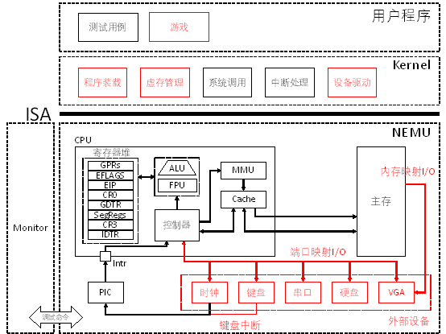

# PA 4-2 外设与I/O

在之前的几个阶段中，我们模拟了CPU的运算、指令执行；存储管理；异常和中断响应的相关功能。我们的模拟器功能已日趋完备！现在，我们可以向一台完整的计算机迈出最后的一步了。我们要在模拟器中增加与外部设备进行I/O的功能。如此我们的模拟器就能够实现包括键盘输入、屏幕输出等功能，能够与用户互动起来，完成除了运算以外更加丰富的功能。



图4-2 PA 4-2 外设与I/O路线图


## §4-2.1 预备知识

要完成与外设的I/O，核心要解决两个问题：

1. 与谁进行I/O？

2. I/O的内容是什么？

对于第一个问题的回答涉及到I/O寻址的方式。一种I/O寻址方式是端口映射I/O（Port-mapped I/O）。端口映射I/O的方式相当于打电话：先拨号，再通话。在计算机中有一系列的设备控制器，这些控制器一头通过I/O总线与主机相连，另一头则连接着被控制的外设。设备控制器中包含一系列的寄存器：控制寄存器，用于存放主机送来的控制信号；状态寄存器，用于存放设备状态如就绪和错误信息；数据缓冲寄存器，用于临时存放主机和设备间需要交换的数据信息。通常，把以上三类寄存器统称为I/O端口。IA-32共定义了65536个8位的I/O端口。在端口映射的I/O方式下，CPU通过专门的I/O指令`in`（`ins`）和`out`（`outs`）来对某一个端口进行读和写。市场上的计算机绝大多数都是IBM PC兼容机，IBM PC兼容机对常见设备端口号的分配有专门的规定。当然我们也可以自定义端口号与外设之间的分配和对应关系。简言之，通过对某一特定端口的读写，就可以完成CPU和某特定外设之间的数据交换。至于交换的数据是控制命令、状态还是数据，则不是CPU所关心的了。

另一种I/O寻址方式是内存映射I/O(memory-mapped I/O)。这种寻址方式将一部分物理内存映射到I/O设备空间中，使得CPU可以通过普通的访存指令来访问设备。这种物理内存的映射对CPU是透明的，CPU觉得自己是在访问内存，但实际上可能是访问了相应的I/O空间。这样以后，访问设备的灵活性就大大提高了。一个例子是物理地址区间` [0xa0000, 0xc0000)`，这段物理地址区间被映射到VGA内部的显存, 读写这段物理地址区间就相当于对读写VGA显存的数据。例如：

```c
memset((void *)0xa0000, 0, SCR_SIZE);
```

会将显存中一个屏幕大小的数据清零，即往整个屏幕写入黑色像素，作用相当于清屏。

对于第二个问题，即具体怎么通信，则不是我们要关心的内容了。正如在端口映射I/O最后我们谈到的那样，CPU只会忠实地将程序给出的字节交给指定的端口，或从指定端口读出字节。至于这些字节数据如何解释，是软件（设备驱动程序）该关心的事情，和计算机无关。计算机通过上述I/O寻址方式打通了CPU与外设之间的桥梁，接下来就是设备制造商和设备用户之间通过约定各种通信和控制协议来进行下一步的沟通了。

## §4-2.2 代码导读和实验理解

目前在NEMU中我们模拟了四种外设：串口（Serial）、硬盘（IDE）、显示器（VGA）和键盘（Keyboard）。所有和设备相关的代码都可以在`nemu/include/device`和`nemu/src/device/`文件夹下找到。

#### §4-2.2.1 端口映射I/O模拟

在`nemu/src/device/io/port_io.c`源文件中有一个`pio_handler_table`数组，其中维护了端口和外设之间的映射关系，即，端口号`port`和处理函数`handler`之间的对应关系。同时提供了两个接口函数`pio_write()`和`pio_read()`供`out`和`in`指令调用。`pio_handler_table`数组建立了某一个端口及其处理函数（`handler`）之间的对应关系，当对某一个端口进行读写时，会调用该端口对应的处理函数来模拟设备的相应动作。在`nemu/include/device/port_io.h`头文件中我们提供了宏`make_pio_handler`来帮助声明处理函数。

为了使得CPU能够通过端口映射的I/O与外设进行通信，需要实现`in`和`out`两条指令。

##### * 模拟串口

对串口进行模拟时，我们约定规定串口的端口为从`0x3F8`开始的连续8个端口。对`0x3F8`端口进行1字节的写操作对应在控制台上输出一个字符（ASCII码编码）。

在NEMU中，要开启对串口的模拟，需要在`include/config.h`中定义宏`HAS_DEVICE_SERIAL`。定义该宏后，NEMU会在每次`restart`时初始化`serial`。最关键的，它会改变Kernel进行`fs_write()`时的行为。在此之前，Kernel都是通过调用`opcode`为`0x82`的`nemu_trap`指令来帮助我们完成输出的。这条指令在真实的机器中并不存在，没有输出设备也不可能实现字符串的输出，借用`nemu_trap`指令来帮助输出是NEMU为了调试和实验方便而设计的一个权宜之计，因此每次通过`nemu_trap`指令来帮助输出时我们都会在控制台上打出醒目的`nemu trap output: `这一标记。

在实现了serial之后，我们就可以停止使用`nemu_trap`指令的输出功能了，在`fs_write()`中调用`serial_printc()`来通过向`0x3F8`端口写字节的方式在控制台上一个一个地输出字符。自然地，`nemu trap output: `这一标记也就消失了。在对应的实验中，我们需要你帮助实现`serial_printc()`函数的功能，将传入的参数`ch`通过serial输出到控制台上。在`kernel/include/x86/io.h`中框架代码已经封装好了`in`和`out`指令的调用，请选择合适的函数调用。

在完成对serial的模拟后，再次运行`hello-inline`测试用例，可以看到输出内容前的`nemu trap output: `标记消失了。在充分理解了上一阶段实验的`hello-inline`测试用例的工作原理后，相信对于输出的过程已经有了全面的认识，对于实现模拟串口后输出方式的改变，也应当能够充分理解。

##### * 模拟硬盘

在对硬盘展开模拟时，我们将注意力主要集中在端口映射的I/O这一方式上，采用DMA方式的磁盘读写操作暂不涉及，有兴趣的同学可以自学。在端口映射的I/O方式下，约定硬盘设备对应的端口号为`0x1F0`开始的连续8个端口，其中`0x1F0 `为数据端口，当对磁盘进行读写时，从`0x1F0`开始的4个字节都可以作为数据端口使用；`0x1F7`为控制和状态端口，用于标识硬盘处于读（`0x20`）、写（`0x30`）或空闲（`0x40`）状态；在进行读写之前，需要进行磁盘准备工作，向`0x1F3 ~ 0x1F6`这四个端口写入要读或写的扇区号（小端方式），每个扇区大小为512字节。在使用磁盘进行读写时，首先向磁盘`0x1F3 ~ 0x1F6`控制寄存器写入要读写的扇区号；第二向`0x1F7`控制寄存器写入读或写控制命令；最后可以通过读写数据端口实现对磁盘对应扇区512字节的读写操作。

在NEMU中，通过在`include/config.h`中定义宏`HAS_DEVICE_IDE`来开启对硬盘的模拟。在`nemu/src/device/dev/ide.c`中实现了对硬盘的模拟。其中的`init_ide()`函数供NEMU在初始化时调用，将模拟的硬盘设备关联到Linux系统中的一个文件，比如测试用例的ELF文件。对于模拟硬盘的读写就对应文件的读写。`handler_ide()`处理函数实现了硬盘对控制信号的响应，响应的方式根据端口对应的数据或控制寄存器值的约定实现，请结合代码和上面一小段的描述进行理解。

在Kernel中的`kernel/src/driver/ide`文件夹中，包含了对硬盘驱动程序的封装。`disk.c`源文件中提供的`ide_read()`和`ide_write()`函数是磁盘驱动程序对外提供的接口，供其它模块调用实现对磁盘的读写。其中实现了对磁盘的cache等功能，具体在教程中就不展开论述了。感兴趣的同学可以结合代码深入理解相应的功能。

在实现了硬盘的模拟之后，我们可以让ram disk退休了。在定义了`HAS_DEVICE_IDE`宏之后，在NEMU每次重启时都会通过`init_ide()`将测试用例的ELF文件挂载到模拟硬盘。随着ram disk的退休和ide disk的开启，需要改变Kernel装载程序的`loader()`，使其从ide disk装载ELF文件。当然在NEMU中，Kernel还是通过image镜像的方式进行加载的。到操作系统实验部分，大家会进一步了解，其实在开机之后内存中只会加载一个很小的引导程序image。通过引导程序装载Kernel之后，再由Kernel装载用户程序。在计算机系统基础实验课中，我们省略了前面的步骤，将整个Kernel的镜像作为一个大引导程序整个装载到内存中。

##### * 模拟VGA显示器的控制端口

VGA的显示采用内存映射I/O的方式，但是也有一些控制命令需要通过端口进行发送。在NEMU中，我们已经实现了VGA这一部分的功能，只需结合代码大致理解即可。VGA实验的重点在于下一节中要实现的内存映射I/O的模拟。

##### * 模拟键盘

在NEMU中，通过在`include/config.h`中定义宏`HAS_DEVICE_KEYBOARD`来开启对键盘的模拟。对键盘展开模拟时，键盘事件首先在`nemu/src/device/sdl.c`中由`NEMU_SDL_Thread()`线程捕获。NEMU捕获两类事件：键盘按下和抬起。当检测到相应事件后，将对应键的扫描码作为参数传送给`keyboard.c`中的模拟键盘函数。模拟键盘缓存扫描码，并通过中断请求的方式通知CPU有按键或抬起的事件，键盘的中断请求号为1。CPU收到中断请求后调用Kernel的中断响应程序。在响应程序中，Kernel会查找是否有应用程序注册了对键盘事件的响应，若有，则通过调用注册的响应函数的方式来通知应用程序。此时在应用程序的键盘响应函数中，可以通过in指令从键盘的数据端口读取扫描码完成数据交换。键盘数据端口约定为`0x60`，键盘扫描码的编码方式参照这个[[1\]](#_ftn1)约定。

使用SDL来捕获键盘事件需要有一个窗口，在窗口中进行的键盘输入才会被SDL捕获。因此在开启键盘模拟后，会跳出一个全黑的窗口。在开启VGA模拟之前，这个窗口不会输出任何信息，只能接收来自键盘的输入信息。

在实现了模拟键盘后，我们能开启最后一个测试用例`echo`。运行`echo`，每次在窗口中键入一个英文字母，就会在标准输出中打印一个对应的大写字母。在`echo`启动后，它会向Kernel注册监听键盘事件，并在每一个键盘事件到来后，判断是否进行输出。在`echo.c`测试用例的代码中，我们其实在一个`.c`文件中包含了原本应该分散在应用程序、库文件、操作系统头文件、设备驱动程序中的各种功能。从软件工程和程序设计的角度来说，`echo`的写法不是很好：各个抽象层次、功能模块的代码全都紧耦合在一起。以后写代码千万不能照着这种泛型去写！但是仅仅从课程教学的角度来说，它在尽可能少的代码中包装了尽可能多的知识点。读懂`echo`的代码并回答实验问题，是对中断响应、系统调用和端口映射I/O的一次全面的回顾。

可以通过关闭窗口或在控制台Ctrl-c的方式退出`echo`。

------

[[1\]](#_ftnref1) http://www.mouseos.com/os/doc/scan_code.html

#### §4-2.2.2 内存映射I/O模拟

可以通过在`include/config.h`中定义宏`HAS_DEVICE_VGA`来开启对VGA的模拟。对显示器（VGA）进行模拟时，我们采用内存映射I/O的方式来向显示器发送待显示的数据。我们约定内存从物理地址`0xa0000`开始，长度为` 320 * 200`字节的区间为显存区间。

在`nemu/src/memory/memory.c`中，为物理地址读写的函数添加是否是`mm_io`的判断。通过`is_mmio()`函数判断一个物理地址是否被映射到I/O空间。如果是，`is_mmio()`会返回映射号，否则返回-1。内存映射I/O的访问需要调用`mmio_read()`或`mmio_write()`，调用时需要提供映射号。如果不是内存映射I/O的访问，就访问主存。

为用户进程创建video memory的虚拟地址空间。在`loader() `函数中有一处代码会调用` create_video_mapping()`函数(在`kernel/src/memory/vmem.c `中定义)，为用户进程创建video memory的恒等映射，即把从`0xa0000`开始, 长度为`320 * 200`字节的虚拟内存区间映射到从`0xa0000`开始，长度为`320 * 200`字节的物理内存区间。具体的，你需要定义一些页表项（注意页表需要按页对齐, 你可以参考`kernel/src/memory/kvm.c`中的相关内容），然后填写相应的页目录项和页表项即可。如果创建地址空间和内存映射I/O的实现都正确，你会看到屏幕上输出了一些测试时写入的颜色信息，同时`video_mapping_read_test()`将会通过检查。

## §4-2.3 实验过程及要求

##### * 代码要求

#### §4-2.3.1 完成串口的模拟

1. 在`include/config.h`中定义宏`HAS_DEVICE_SERIAL`并`make clean`；

2. 实现`in`和`out`指令；
3. 实现`serial_printc()`函数；

4. 运行`hello-inline`测试用例，对比实现串口前后的输出内容的区别。

#### §4-2.3.2 通过硬盘加载程序

1. 在`include/config.h`中定义宏`HAS_DEVICE_ID`并`make clean`；

2. 修改Kernel中的`loader()`，使其通过`ide_read()`和`ide_write()`接口实现从模拟硬盘加载用户程序；

3. 通过`make test_pa-4-2`执行测试用例，验证加载过程是否正确。

#### §4-2.3.3 完成键盘的模拟

1. 在`include/config.h`中定义宏`HAS_DEVICE_KEYBOARD`并`make clean`；

2. 通过`make test_pa-4-2`运行`echo`测试用例；（可以通过关闭窗口或在控制台Ctrl-c的方式退出`echo`）

#### §4-2.3.4 实现VGA的MMIO

1. 在`include/config.h`中定义宏`HAS_DEVICE_VGA`；

2. 在`nemu/src/memory/memory.c`中添加`mm_io`判断和对应的读写操作；

3. 在`kernel/src/memory/vmem.c`中完成显存的恒等映射；

4. 通过`make test_pa-4-2`执行测试用例，观察输出测试颜色信息，并通过`video_mapping_read_test()`。

## 本阶段要修改的代码清单（参考）
* `include/config.h`
* `kernel/src/elf/elf.c`
* `kernel/src/lib/serial.c`
* `kernel/src/memory/vmem.c`
* `nemu/include/cpu/instr/in.c`
* `nemu/include/cpu/instr/in.h`
* `nemu/include/cpu/instr/out.c`
* `nemu/include/cpu/instr/out.h`
* `nemu/src/cpu/instr/in.c`
* `nemu/src/cpu/instr/in.h`
* `nemu/src/cpu/instr/out.c`
* `nemu/src/cpu/instr/out.h`
* `nemu/src/cpu/decode/opcode.c`
* `nemu/src/memory/memory.c`


