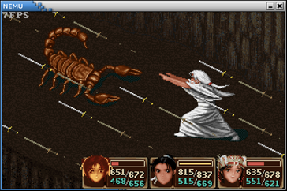

# PA 4-3 可选任务：游戏移植

如果通过了上述所有的阶段，那么我们就可以为我们的PA加入最后的拼图，移植打字小游戏和仙剑奇侠传了。*从2018年秋季的3.0版本起，我们安排了片尾曲和制作人员列表作为最后的小游戏，该小游戏也用于最后阶段的测试用例。

在开始PA 4-3前，请先访问以下仓库：

* GitHub：https://github.com/ics-nju-wl/icspa-public-data
* Gitee镜像：https://gitee.com/wlicsnju/icspa-public-data

按照仓库中的说明下载`data`文件夹，并将其放置于项目的`game/data`目录下


## §4-3.1 移植打字小游戏

框架代码中的` game `目录下包含三款游戏, 共用的部分存放在` game/src/common `目录下, 游戏各自的逻辑分别存放在` game/src/typing `和` game/src/nemu-pal `中. 可以通过修改` game/Makefile`中的` GAME `变量在两个游戏之间切换(需要重新编译).

打字小游戏来源于2013年oslab0的框架代码, 为了配合移植, 代码的结构做了少量调整, 同时去掉了和显存优化相关的部分.

我们对游戏的初始化部分进行一些说明:

游戏入口是` game/src/common/main.c `中的` game_init() `函数.

`init_timer() `函数用于设置`100Hz`的时钟频率, 但由于NEMU中的时钟模拟实现是不可编程的, 而且模拟实现的时钟的默认频率就是`100Hz`, 故此处的` init_timer() `函数并没有实际作用.

在游戏中, `add_irq_handle()` 是一个人为添加的系统调用, 其系统调用号是0, 用于注册一个中断处理函数. 已经注册的中断处理函数会在相应中断到来的时候被内核调用, 这样游戏代码就可以通过中断来控制游戏的逻辑了. 但在真实的操作系统中, 提供这样的系统调用是非常危险的: 恶意程序可以注册一个陷入死循环的中断处理函数, 由于操作系统处理中断的时候, 处理器一般都处于关中断状态, 若此时陷入了死循环, 操作系统将彻底崩溃.

使用` Log() `宏输出一句话. 在游戏中, 通过` Log() `宏输出的信息都带有` {game} `的标签, 方便和kernel中的` Log() `宏输出区别开来.

进入游戏逻辑主循环. 整个游戏都在中断的驱动下运行.

在工程目录下运行` make test_pa-4-3 `命令编译游戏.

如果前面的实现都正确，那么原则上你可以直接运行打字小游戏。

## §4-3.2 移植仙剑奇侠传

原版的仙剑奇侠传是针对Windows平台开发的, 因此它并不能在GNU/Linux中运行(你知道为什么吗?), 也不能在NEMU中运行. 网友weimingzhi开发了一款基于SDL库, 跨平台的仙剑奇侠传, 工程叫SDLPAL. 你可以通过` git clone `命令把SDLPAL克隆到本地, 然后把仙剑奇侠传的数据文件(我们已经把数据文件上传到提交网站上)放在工程目录下（`game/src/nemu-pal/`）, 执行` make `编译SDLPAL, 编译成功后就可以玩了. 更多的信息请参考SDLPAL工程中的README说明.

把仙剑奇侠传移植到NEMU中的主要工作, 就是把应用层之下提供给仙剑奇侠传的所有API重新实现一遍, 因为这些API大多都依赖于操作系统提供的运行时环境, 我们需要根据NEMU和kernel提供的运行时环境重写它们. 主要包括以下三部分内容:

1. C标准库

2. SDL库

3. 文件系统       

`newlib`已经提供了C标准库的功能, 因此我们可以很简单地对这两部分内容进行移植, 重点则落到了SDL库和文件系统的移植工作中.

我们把待移植的仙剑奇侠传称为NEMU-PAL. NEMU-PAL在SDLPAL的基础上经过少量修改得到, 包括去掉了声音, 修改了` game/src/nemu-pal/device/input.c `中和按键相关的处理, 把我们关心的和SDL库的实现整理到` game/src/nemu-pal/hal `目录下, 一些我们不必关心的实现则整理到` game/src/nemu-pal/unused `目录下.

为了编译NEMU-PAL, 你需要修改` game/Makefile `中的` GAME `变量, 从打字小游戏切换到NEMU-PAL. 然后把仙剑奇侠传的数据文件放在` game/src/nemu-pal/data `目录下, 工程目录下执行` make test_pa-4-3 `即可.

下面来谈谈移植工作具体要做些什么. 在这之前, 请确保你已经理解打字小游戏的工作方式.

##### * 重写SDL库的API   

在SDLPAL中, SDL库负责时钟, 按键, 显示和声音相关的处理. 由于在NEMU中没有模拟声卡的实现, NEMU-PAL已经去掉了和声音相关的部分. 其余三部分的内容被整理到` game/src/nemu-pal/hal `目录下, 其中HAL(Hardware Abstraction Layer)是硬件抽象层的意思, 和硬件相关的功能将在HAL中被打包, 提供给上层使用.

**时钟相关**

1. `SDL_GetTicks() `用于返回用毫秒表示的当前时间(从运行游戏时开始计算).

2. `SDL_Delay() `用于延迟若干毫秒.

3. `jiffy `变量记录了时钟中断到来的次数, 通过它可以实现上述和时钟相关的控制功能.

**键盘相关**

键盘通常都支持"重复按键", 即若一直按着某一个键不松开, 键盘控制器将会不断发送该键的扫描码. 但是SDLPAL(包括待移植的NEMU-PAL)的游戏逻辑是在基于"非重复按键"的特性编写的, 即若一直按着某一个键不松开, SDLPAL只会收到一次该键的扫描码. 因此HAL需要把键盘的"重复按键"特性屏蔽起来, 向上层提供"非重复按键"的特性.

1. 实现这一抽象的方法是记录按键的状态. 你需要在键盘中断处理函数` keyboard_event() `中编写相应代码, 根据从键盘控制器得到的扫描码记录按键的状态.

2. `process_keys() `函数会被NEMU-PAL轮询调用. 每次调用时, 寻找一个刚刚按下或刚刚释放的按键, 并调用相应的回调函数, 然后改变该按键的状态. 若找到这样的按键, 函数马上返回` true `; 若找不到, 函数返回` false `. 注意返回之前需要打开中断.

3. 代码中提供了数组的实现方式用于记录按键的状态, 你也可以使用其它方式来实现上述抽象.

**显示相关**

SDL中包含很多和显示相关的API, 为了重写它们, 你首先需要了解它们的功能. 通过 man 命令查阅以下内容:

- SDL_Surface

- SDL_Rect

- SDL_BlitSurface

- SDL_FillRect

- SDL_UpdateRect

在` game/src/nemu-pal/include/hal.h `中已经定义了相关的结构体, 你需要阅读` man `, 了解相关成员的功能, 然后实现` game/src/nemu-pal/hal/video.c `中相应函数的功能. 你可以忽略` man `中提到的"锁"等特性, 我们并不打算在NEMU-PAL中实现这些特性.

**实现简易文件系统**

对于大部分游戏来说, 游戏用到的数据所占的空间比游戏逻辑本身还大, 因此这些数据一般都存储在磁盘中. IDE驱动程序已经为我们屏蔽了磁盘的物理特性, 并提供了读写接口, 使得我们可以很方便地访问磁盘某一个位置的数据. 但为了易于上层使用, 我们还需要提供一种更高级的抽象, 那就是文件.

文件的本质就是字节序列, 另外还由一些额外的属性构成. 在这里, 我们只讨论磁盘上的文件. 这样, 那些额外的属性就维护了文件到磁盘存储位置的映射. 为了管理这些映射, 同时向上层提供文件操作的接口, 我们需要在kernel中实现一个文件系统.

不要被"文件系统"四个字吓到了, 我们需要实现的文件系统并不是那么复杂, 这得益于NEMU-PAL的一些特性: 对于大部分数据文件来说, NEMU-PAL只会读取它们, 而不会对它们进行修改; 唯一有可能进行文件写操作的, 就只有保存游戏进度, 但游戏存档的大小是固定的. 因此我们得出了一个重要的结论: 我们需要实现的文件系统中, 所有文件的大小都是固定的. 既然文件大小是固定的, 我们自然也可以把每一个文件分别固定在磁盘中的某一个位置. 这些很好的特性大大降低了文件系统的实现难度, 当然, 真实的文件系统远远比这个简易文件系统复杂.

我们约定磁盘的最开始用于存放NEMU-PAL游戏程序, 从1MB处开始一个挨着一个地存放数据文件:

```
0                      1MB
+------------+----------+----------+---------+----------+------------+----
|            |          |          |         |          |            |
|  NEMU-PAL  |          |  1.rpg   |  2.rpg  |  ......  |  word.dat  |
|            |          |          |         |          |            |
+------------+----------+----------+---------+----------+------------+----

图4-3 简易文件系统
```

`kernel/src/fs/fs.c `中已经列出了所有数据文件的信息, 包括文件名, 文件大小和文件在磁盘上的位置. 但若只有这些信息, 文件系统还是不能表示文件在读写时的动态信息, 例如读写位置的指针等. 为此, 文件系统需要为那些打开了的文件维护一些动态的信息:

```c
typedef struct {
    bool opened;
    uint32_t offset;		
} Fstate;
```

在这里, 我们只需要维护打开状态` opened `和读写指针` offset `即可. 由于这个简易文件系统中的文件数目是固定的, 我们可以为每一个文件静态分配一个` Fstate `结构, 因此我们只需要定义一个长度为` NR_FILES + 3 `的` Fstate `结构数组即可. 这里的 3 包括` stdin `,` stdout `,` stderr `三个特殊的文件, 磁盘中的第 k 个文件固定使用第 k + 3 个` Fstate `结构. 这样, 我们就可以把` Fstate `结构在数组中的下标作为相应文件的文件描述符(` fd `,` file descriptor`)返回给用户层了.

有了` Fstate `结构之后, 我们就可以实现以下的文件操作了:

```c
int fs_open(const char *pathname, int flags);  /* 在我们的实现中可以忽略flags */

int fs_read(int fd, void *buf, int len);

int fs_write(int fd, void *buf, int len);

int fs_lseek(int fd, int offset, int whence);

int fs_close(int fd);
```

这些文件操作实际上是相应的系统调用在内核中的实现, 你可以通过` man `查阅它们的功能, 例如

> man 2 open

其中 2 表示查阅和系统调用相关的` man page. `实现这些文件操作的时候注意以下几点:

1. 由于简易文件系统中每一个文件都是固定的, 不会产生新文件, 因此` "fs_open()  `没有找到` pathname `所指示的文件"属于异常情况, 你需要使用` assertion`终止程序运行.

2. 使用` ide_read() `和` ide_write() `来进行文件的读写.

3. 由于文件的大小是固定的, 在实现` fs_read() `和` fs_lseek() `的时候, 注意读写指针不要越过文件的边界.

4. 除了写入` stdout `和` stderr `之外(即输出到串口), 其余对于` stdin `,` stdout `和` stderr `这三个特殊文件的操作可以直接忽略.

最后你还需要在kernel中编写相应的系统调用, 来调用相应的文件操作, 同时修改` game/src/common/lib/syscall.c `中的代码, 为用户进程开放系统调用接口. 在完成了所有的工作，fix了所有导致程序崩溃的bug之后，你将能够成功运行仙剑奇侠传！



## 本阶段要修改的代码清单（参考）

* `include/config.h` 
* `kernel/src/fs/fs.c` 
* `game/` 

